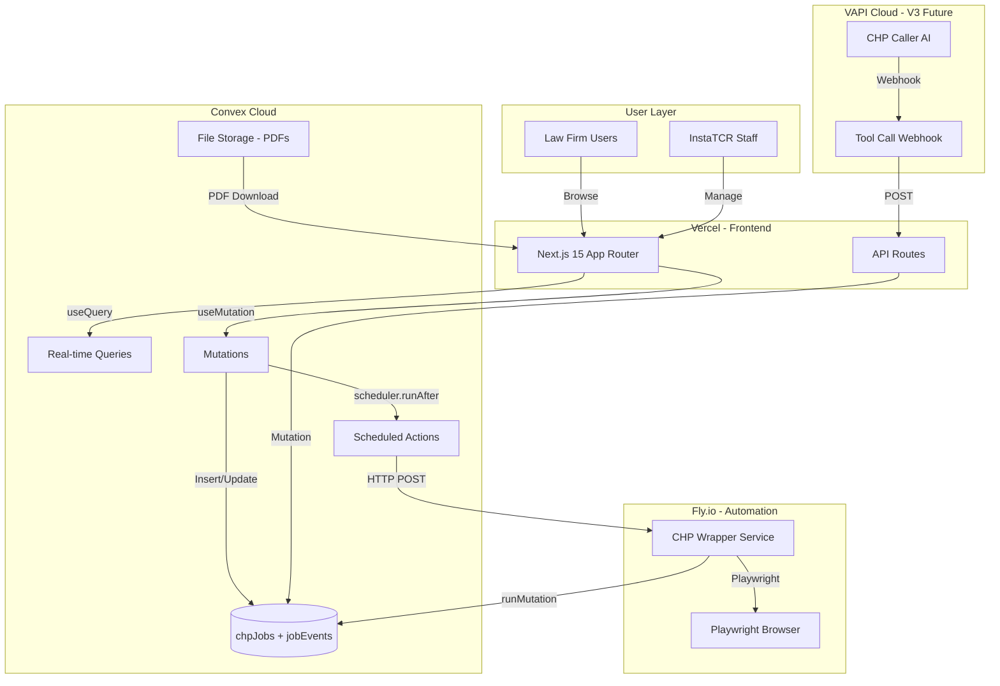
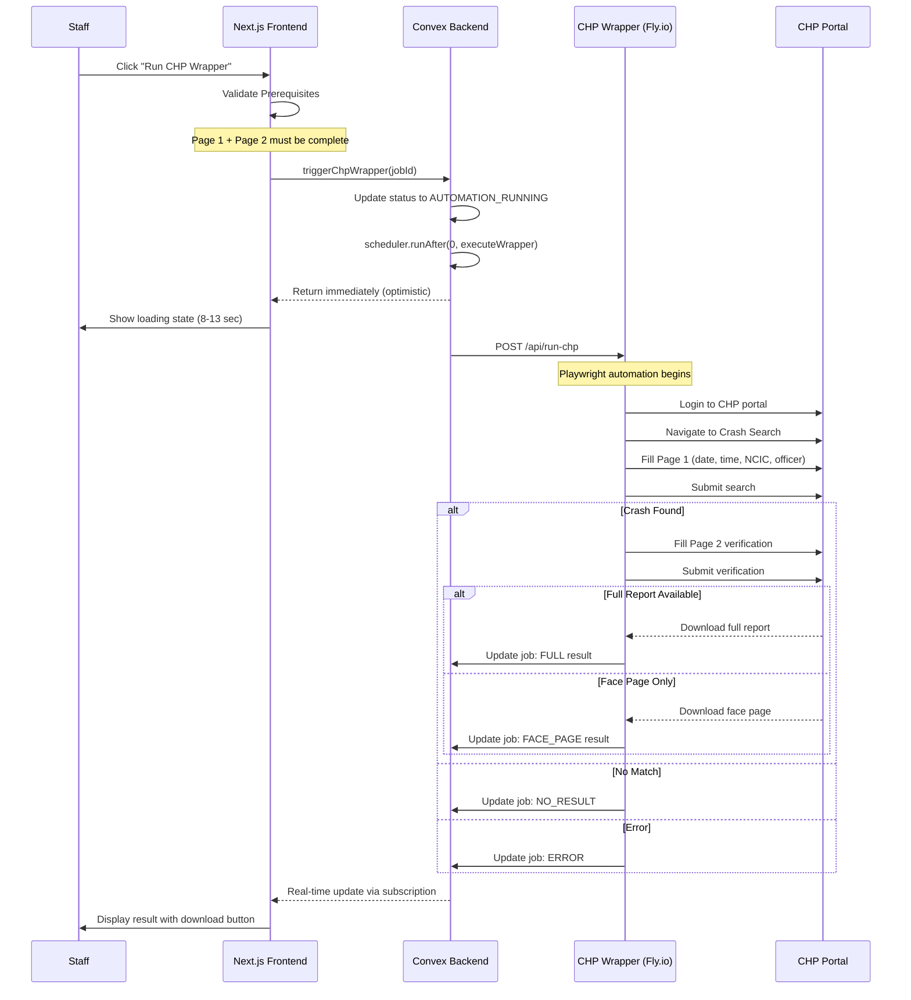
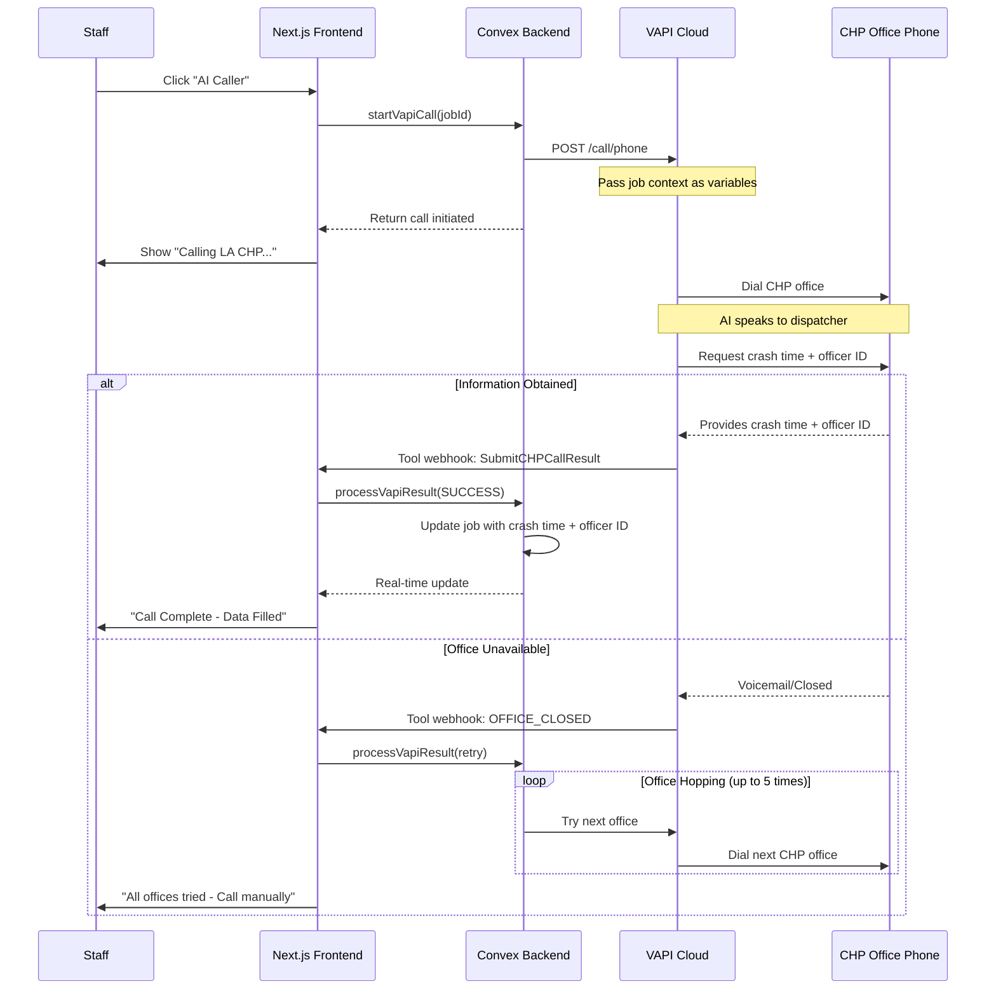
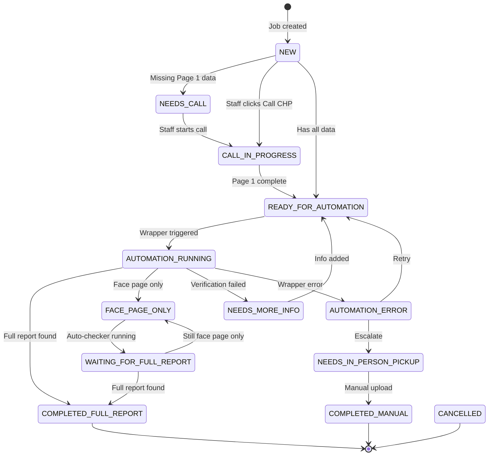
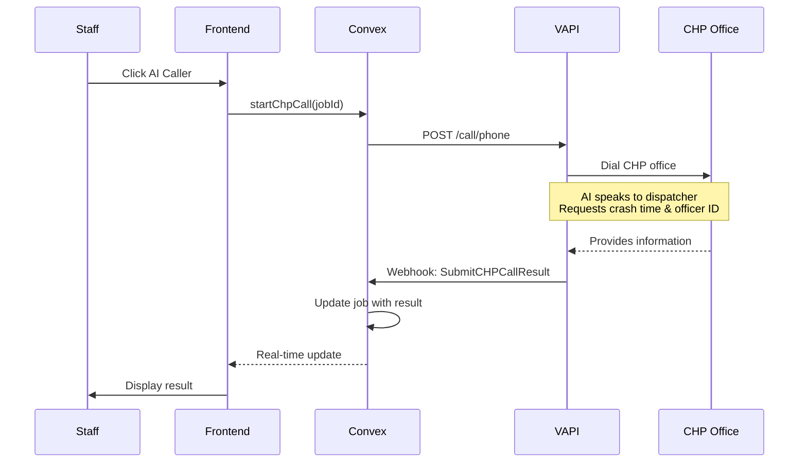
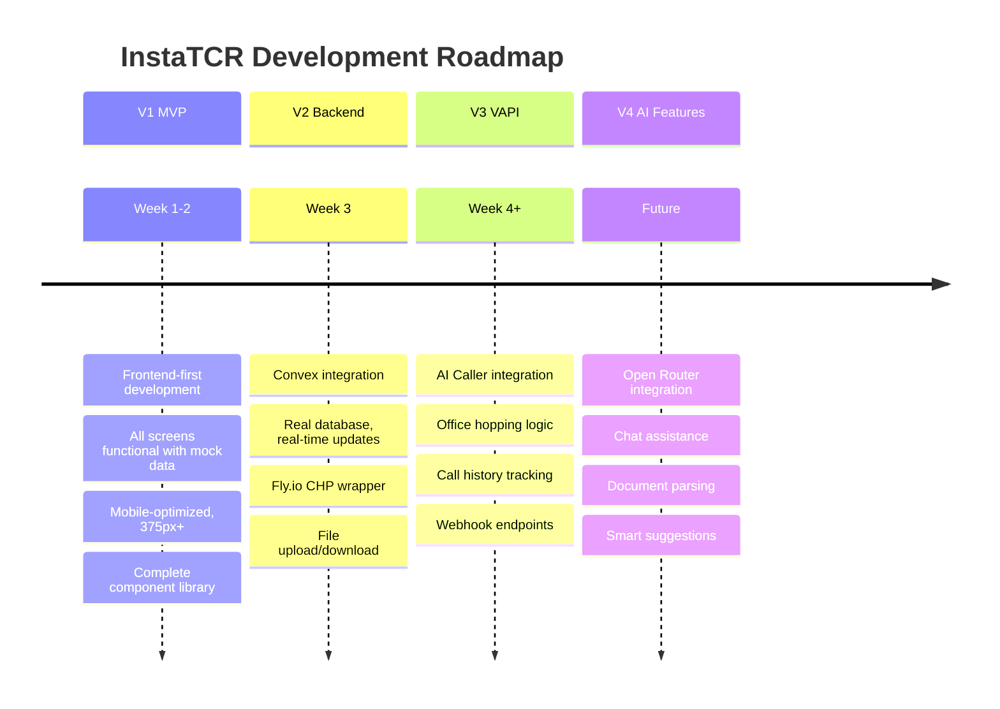
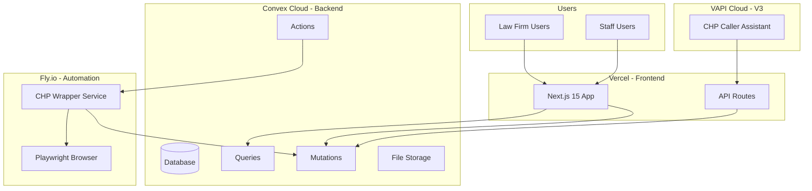

# InstaTCR Master PRD

**Version:** 1.0  
**Date:** December 10, 2025  
**Status:** Authoritative Source Document  
**Purpose:** Comprehensive Product Requirements Document consolidating all InstaTCR specifications

---

## Table of Contents

### Part 1: Project Foundation
- [1. Executive Summary](#1-executive-summary)
- [2. Product Vision & Versioned Roadmap](#2-product-vision--versioned-roadmap)
- [System Architecture Diagrams](#system-architecture-diagrams)

### Part 2: Business Logic & User Flows
- [3. Complete User Flows](#3-complete-user-flows)
- [4. Status System Architecture](#4-status-system-architecture)
- [5. Data Model Reference](#5-data-model-reference)

### Part 3: Complete Screen Specifications
- [6. Law Firm Screens](#6-law-firm-screens)
- [7. Staff Screens](#7-staff-screens)

### Part 4: CHP Wrapper Deep Dive
- [8. CHP Wrapper Architecture](#8-chp-wrapper-architecture)
- [9. CHP Wrapper Behavior Patterns](#9-chp-wrapper-behavior-patterns)
- [10. CHP Wrapper Result Types Reference](#10-chp-wrapper-result-types-reference)
- [11. CHP Wrapper Execution Timeline](#11-chp-wrapper-execution-timeline)

### Part 5: Component Library
- [12. UI Components](#12-ui-components)
- [13. Helper Functions & Utilities](#13-helper-functions--utilities)

### Part 6: Implementation Strategy
- [14. Frontend-First Development (V1)](#14-frontend-first-development-v1)
- [15. Backend Integration (V2)](#15-backend-integration-v2)

### Part 7: Future Integrations
- [16. VAPI AI Caller - UI Planning (V3)](#16-vapi-ai-caller---ui-planning-v3)
- [17. VAPI AI Caller - Backend Architecture (V3)](#17-vapi-ai-caller---backend-architecture-v3)
- [18. Open Router API (V4+)](#18-open-router-api-v4)
- [19. Future Roadmap Timeline](#19-future-roadmap-timeline)

### Part 8: Technical Reference
- [20. Validation Rules](#20-validation-rules)
- [21. Responsive Design Guidelines](#21-responsive-design-guidelines)
- [22. Testing Checklist](#22-testing-checklist)
- [23. Deployment Architecture](#23-deployment-architecture)

### Part 9: Appendices
- [24. Quick Reference](#24-quick-reference)
- [25. Mock Data Instructions](#25-mock-data-instructions)
- [26. Backend Integration Checklist](#26-backend-integration-checklist)

---

# Part 1: Project Foundation

## 1. Executive Summary

### What is InstaTCR?

InstaTCR is a web application for managing California Highway Patrol (CHP) crash report requests. It streamlines the process of requesting, tracking, and obtaining CHP crash reports through automation and manual retrieval.

The application serves as the bridge between personal injury law firms who need crash reports and the CHP system where those reports are stored. InstaTCR automates the tedious process of logging into CHP portals, searching for reports, and downloading documents.

### Two User Groups

#### Law Firms (Attorneys and Paralegals)
- **Goal:** Request and receive crash reports quickly
- **Experience Level:** Non-technical, need simple interface
- **Key Actions:**
  - Submit new crash report requests (client name + report number)
  - Track request status with friendly messages
  - Download completed reports (face page and/or full report)
  - View chat-style timeline of request progress

#### InstaTCR Staff (Internal Team)
- **Goal:** Process requests efficiently using automation
- **Experience Level:** Technical, understand the CHP system
- **Key Actions:**
  - View all jobs across all law firms
  - Enter crash details (Page 1 data: date, time, NCIC, officer ID)
  - Enter verification info (Page 2 data: name, plate, license, VIN)
  - Trigger CHP wrapper automation
  - Handle escalations and manual completions
  - Upload documents and mark jobs complete

### Critical Business Rule

> **Law firms NEVER see technical details about automation, portals, robots, or manual processes.**

They only see friendly, high-level status messages like:
- "We've received your request"
- "We're contacting CHP about your report"
- "Your report is ready to download"

Staff sees all technical details including internal statuses, wrapper results, journey logs, and automation errors.

### Core Business Logic

**Two Report Types:**
- **Face Page:** Preliminary report with basic crash information (often available first)
- **Full Report:** Complete crash report with all details (may take days to become available)

**NCIC Auto-Derivation:**
- NCIC is always the first 4 digits of the report number
- Report number format: `9XXX-YYYY-ZZZZZ` (e.g., "9465-2025-02802")
- NCIC from example: `9465`
- The four digits after NCIC are always the crash year

### Tech Stack

| Layer | Technology | Deployment | Purpose |
|-------|------------|------------|---------|
| Frontend | Next.js 15 (App Router) | Vercel | Server Components, file-based routing |
| Styling | Tailwind CSS | - | Mobile-first responsive design |
| Database | Convex | Convex Cloud | Real-time reactivity, TypeScript-first |
| File Storage | Convex Storage | Convex Cloud | PDF upload/download |
| CHP Automation | Playwright (CHP Wrapper) | Fly.io | Browser automation for CHP portal |
| AI Caller (V3) | VAPI | VAPI Cloud | Voice AI for calling CHP offices |
| AI Features (V4) | Open Router API | - | Chat assistance, document parsing |

---

## 2. Product Vision & Versioned Roadmap

### Version Strategy

InstaTCR follows a phased development approach with clear version boundaries. This prevents scope creep and ensures each phase is complete before moving to the next.

### V1: MVP - Frontend First (13 Days)

**Goal:** Complete, polished frontend with mock data. No backend dependencies.

**Deliverables:**
- All 6 screens fully functional (Landing, Law Dashboard, New Request, Job Detail, Staff Queue, Staff Job Detail)
- Mobile-first responsive design (375px minimum)
- Complete mock data system with realistic sample jobs
- All 8 mobile components (MobileDrawer, FAB, BottomSheet, TabBar, etc.)
- Animations and transitions polished
- Touch targets ≥ 44px verified

**Why Frontend First:**
1. Faster iteration without backend constraints
2. Perfect the UX before locking in API contracts
3. Design review with stakeholders using functional prototype
4. Backend team can work in parallel on infrastructure

**Phase Breakdown:**

| Phase | Duration | Deliverables |
|-------|----------|--------------|
| 1: Setup & Design System | 1 day | Next.js 15, Tailwind, fonts, base components |
| 2: Mock Data System | 1 day | TypeScript interfaces, 15 sample jobs, utilities |
| 3: Law Firm Screens | 3 days | All 4 law firm screens with responsive layouts |
| 4: Staff Screens | 3 days | Queue + job detail with all 7 control cards |
| 5: Mobile Components | 2 days | All 8 mobile-specific components |
| 6: Polish & Refinement | 3 days | Testing, animations, edge cases, accessibility |

### V2: Backend Integration (6 Days)

**Goal:** Connect frontend to real Convex database and CHP wrapper service.

**Deliverables:**
- Convex schema deployed (chpJobs, jobEvents tables)
- Real-time queries replacing mock data
- CHP wrapper on Fly.io integrated
- File upload/download working with Convex Storage
- Authentication with role-based access

**Phase Breakdown:**

| Phase | Duration | Deliverables |
|-------|----------|--------------|
| 1: Convex Setup | 1 day | Schema, queries, mutations |
| 2: CHP Wrapper Integration | 2 days | Fly.io deployment, API connection |
| 3: File Storage | 1 day | PDF upload/download via Convex Storage |
| 4: Auth & Routing | 1 day | Protected routes, role-based access |
| 5: Real-Time Updates | 1 day | Convex reactivity for live status changes |

### V3: VAPI AI Caller (TBD)

**Goal:** Add AI-powered phone calling to automatically obtain crash time and officer ID from CHP offices.

**Deliverables:**
- AI Caller button in Staff Job Detail (Card 1)
- VAPI assistant integration
- Office hopping logic (try multiple offices)
- Call history tracking
- Webhook endpoint for VAPI tool calls

**UI Preparation (Do Now):**
- Design AI Caller button placement (next to Call CHP button)
- Define button states (Idle, Calling, Success, Failed)
- Reserve space for call status display
- Plan call history section in Wrapper History card

### V4: Open Router API (TBD)

**Goal:** Add AI-powered features for enhanced user experience.

**Potential Features:**
- Chat assistance for law firms (answer questions about their requests)
- Document parsing (extract driver name from uploaded face pages)
- Natural language job creation ("Create a request for John Doe, report 9465-2025-02802")
- Smart suggestions (auto-fill fields based on patterns)

### Version Feature Matrix

| Feature | V1 (MVP) | V2 (Backend) | V3 (VAPI) | V4 (AI) |
|---------|----------|--------------|-----------|---------|
| Law Firm Screens | ✅ Mock | ✅ Real | ✅ | ✅ |
| Staff Screens | ✅ Mock | ✅ Real | ✅ | ✅ |
| CHP Wrapper | ✅ Mock (8-13s) | ✅ Real (Fly.io) | ✅ | ✅ |
| File Upload/Download | ✅ Mock | ✅ Real (Convex) | ✅ | ✅ |
| Real-time Updates | ❌ | ✅ Convex | ✅ | ✅ |
| AI Caller Button | 🔲 UI Only | 🔲 UI Only | ✅ Full | ✅ |
| AI Chat | ❌ | ❌ | ❌ | ✅ |
| Document Parsing | ❌ | ❌ | ❌ | ✅ |

**Legend:** ✅ = Fully functional | 🔲 = UI placeholder | ❌ = Not included

---

## System Architecture Diagrams

### Diagram 1: Complete System Architecture



### Diagram 2: CHP Wrapper Execution Flow



### Diagram 3: VAPI AI Caller Flow (V3)



---

# Part 2: Business Logic & User Flows

## 3. Complete User Flows

### Flow 1: Complete Information Path (Happy Path)

**When:** Staff has all crash details including driver name from the start.

**Actors:** Law Firm User, InstaTCR Staff, CHP Wrapper

**Steps:**

1. **Law Firm creates request**
   - Submits client name: "Dora Cruz-Arteaga"
   - Submits report number: "9465-2025-02802"
   - Job created with status: `NEW` → Law firm sees: `SUBMITTED`

2. **Staff enters Page 1 data**
   - Opens job in Staff Job Detail
   - Clicks "Call CHP" button (status → `CALL_IN_PROGRESS`)
   - Enters crash date: "12/01/2025"
   - Enters crash time: "1430" (2:30 PM)
   - NCIC auto-derived: "9465"
   - Enters officer ID: "012345"
   - Saves Page 1

3. **Staff enters Page 2 data**
   - First name auto-populated: "Dora"
   - Last name auto-populated: "Cruz-Arteaga"
   - Optionally adds plate, license, VIN
   - Saves Page 2

4. **Staff triggers CHP Wrapper**
   - Prerequisites met (Page 1 complete + Page 2 has name)
   - Clicks "Run CHP Wrapper"
   - Status → `AUTOMATION_RUNNING` → Law firm sees: `CONTACTING_CHP`
   - Wrapper runs for 8-13 seconds

5. **Result: Full Report Downloaded**
   - Wrapper returns: `FULL`
   - Status → `COMPLETED_FULL_REPORT` → Law firm sees: `REPORT_READY`
   - Staff downloads PDF, reviews, marks complete
   - Law firm can download full report

**Timeline:** ~5-10 minutes total

---

### Flow 2: Incomplete Information Path

**When:** Staff only has Page 1 details, no driver name yet.

**Actors:** Law Firm User, InstaTCR Staff, CHP Wrapper

**Steps:**

1. **Law Firm creates request** (same as Flow 1)

2. **Staff enters Page 1 data only**
   - Has crash date, time, NCIC, officer ID
   - Does NOT have driver name (law firm didn't provide)
   - Saves Page 1

3. **Staff attempts to run wrapper**
   - Button disabled: "Complete Page 1 and add at least one Page 2 field"
   - OR if forced: Wrapper returns `ERROR` - "Verification required"

4. **Job paused**
   - Status → `NEEDS_MORE_INFO` → Law firm sees: `NEEDS_INFO`
   - Message: "We need a bit more information to continue"
   - Auto-checker: LOCKED

**Resolution:** Staff must obtain driver name (from law firm or CHP call) before retrying.

---

### Flow 3: Face Page Upload & Driver Name Entry

**When:** Staff received physical face page from CHP (in-person pickup) or wrapper returned face page only.

**Actors:** InstaTCR Staff

**Steps:**

1. **Starting state:** Job in `FACE_PAGE_ONLY` or `NEEDS_MORE_INFO`

2. **Staff opens Manual Completion card**
   - Selects file type: "Face Page"
   - Clicks "Upload File"
   - Selects PDF from computer

3. **Staff enters guaranteed name**
   - Required field appears: "Guaranteed Name"
   - Enters name exactly as shown on face page: "DORA CRUZ-ARTEAGA"
   - This is the verified name from the official document

4. **Staff saves**
   - Face page stored in Convex Storage
   - Guaranteed name stored on job
   - Status → `FACE_PAGE_ONLY` (if wasn't already)
   - Auto-checker: UNLOCKED

5. **Result**
   - Law firm can download face page
   - Staff can use auto-checker to monitor for full report
   - Message: "We've received a preliminary copy (face page) from CHP"

---

### Flow 4: Auto-Checker ("Is This Ready Yet?")

**When:** Job has face page AND driver name (auto-checker unlocked).

**Actors:** InstaTCR Staff, CHP Wrapper

**Unlock Conditions:**
- Has face page document (uploaded or from wrapper)
- Has driver name (guaranteed name from face page OR firstName/lastName from Page 2)

**Steps:**

1. **Staff opens Auto-Checker card**
   - Shows "Unlocked" status with green checkmarks
   - Conditions displayed:
     - ✅ Has face page: Yes
     - ✅ Has driver name: Yes

2. **Staff clicks "Check if Full Report Ready"**
   - Button shows loading state
   - System calls CHP wrapper with stored info
   - Checks if full report now available

3. **Result A: Still Only Face Page**
   - Wrapper returns: `FACE_PAGE`
   - Message: "The full report isn't ready yet. Check back later."
   - Status remains: `FACE_PAGE_ONLY`
   - Auto-checker stays unlocked (can check again)

4. **Result B: Full Report Now Available**
   - Wrapper returns: `FULL`
   - Message: "Great news! We just grabbed the full report."
   - Full report downloaded and stored
   - Status → `COMPLETED_FULL_REPORT` → Law firm sees: `REPORT_READY`

**Note:** Auto-checker can still be run even after full report obtained (for re-downloading if needed).

---

### Flow 5: Manual Escalation

**When:** Automation fails repeatedly or cannot proceed.

**Actors:** InstaTCR Staff, Specialist

**Escalation Triggers:**
- Multiple `ERROR` results from wrapper
- `NO_RESULT` with no additional party info available
- Special circumstances (corrupt files, portal issues)

**Steps:**

1. **Staff opens Escalation card**
   - Clicks "Escalate to Manual Pickup"

2. **Staff enters escalation notes**
   - Explains why escalating: "Wrapper failed 3 times, CHP portal may be down"
   - Confirms escalation

3. **Job escalated**
   - Status → `NEEDS_IN_PERSON_PICKUP` → Law firm sees: `IN_PROGRESS`
   - Job visible to all staff globally (V1: no individual assignment)

4. **Specialist retrieves report**
   - Goes to CHP office in person
   - Obtains physical copy
   - Returns to InstaTCR

5. **Specialist uploads and completes**
   - Opens Manual Completion card
   - Selects "Full Report"
   - Uploads PDF
   - Adds completion notes
   - Clicks "Mark as Completed"
   - Status → `COMPLETED_MANUAL` → Law firm sees: `REPORT_READY`

---

### Flow 6: VAPI AI Caller (Future V3)

**When:** Staff needs crash time and officer ID but doesn't want to call manually.

**Actors:** InstaTCR Staff, VAPI AI Caller, CHP Office

**Steps:**

1. **Staff opens Page 1 Data card**
   - Sees two buttons: "Call CHP" (manual) and "AI Caller" (automatic)
   - Clicks "AI Caller" button

2. **VAPI initiates call**
   - Button shows: "🔄 AI calling Los Angeles CHP..."
   - Status display: "Attempt 1 of 5 • 00:45 elapsed"

3. **AI speaks to CHP dispatcher**
   - Introduces as calling from law firm
   - Provides report number (digit by digit)
   - Requests crash time and officer ID
   - Confirms information received

4. **Result A: Success**
   - AI obtained crash time and officer ID
   - Fields auto-filled in Page 1 form
   - Button shows: "✅ Call Complete - Data Filled"
   - Staff reviews and saves

5. **Result B: Office Failed**
   - AI couldn't get info (office closed, no match, etc.)
   - System tries next office (office hopping)
   - "Attempt 2 of 5 • Trying East LA CHP..."

6. **Result C: All Offices Failed**
   - After 5 attempts, all failed
   - Button shows: "❌ Call Failed - Try Manual"
   - Staff must call manually

**Office Hopping Logic:**
- Retryable outcomes: `OFFICE_CLOSED_OR_VOICEMAIL`, `CALL_DROPPED_OR_TOO_NOISY`, `TRANSFERRED_LOOP_OR_TIMEOUT`
- Non-retryable: `SUCCESS`, `REPORT_NOT_FOUND`, `NO_INFORMATION_GIVEN`

---

## 4. Status System Architecture

### Status Design Philosophy

The status system has two layers:
1. **Internal Status:** What staff sees - technical, detailed, reflects actual system state
2. **Public Status:** What law firms see - friendly, simplified, hides technical details

This separation is critical: law firms should never know about automation, manual pickups, or technical errors.

### Complete Status Mapping Table

| Internal Status | Public Status | Badge Color | Description (Staff) | Message (Law Firm) |
|-----------------|---------------|-------------|---------------------|-------------------|
| `NEW` | `SUBMITTED` | Gray | Job just created, not yet processed | "We've received your request" |
| `NEEDS_CALL` | `IN_PROGRESS` | Blue | Requires phone call to CHP for crash details | "We're working on your request" |
| `CALL_IN_PROGRESS` | `CONTACTING_CHP` | Blue (pulse) | Currently calling CHP | "We're contacting CHP about your report" |
| `READY_FOR_AUTOMATION` | `IN_PROGRESS` | Blue | Ready to trigger CHP wrapper | "We're working on your request" |
| `AUTOMATION_RUNNING` | `CONTACTING_CHP` | Blue (animated) | CHP wrapper currently executing | "We're contacting CHP about your report" |
| `FACE_PAGE_ONLY` | `FACE_PAGE_READY` | Yellow | Face page downloaded, full report not ready | "We've received a preliminary copy (face page) from CHP" |
| `WAITING_FOR_FULL_REPORT` | `WAITING_FOR_REPORT` | Yellow | Checking if full report available | "We're waiting for the full report from CHP" |
| `COMPLETED_FULL_REPORT` | `REPORT_READY` | Green | Full report successfully downloaded | "Your report is ready to download" |
| `COMPLETED_MANUAL` | `REPORT_READY` | Green | Manually completed by specialist | "Your report is ready to download" |
| `NEEDS_MORE_INFO` | `NEEDS_INFO` | Amber | Missing verification info (driver name) | "We need a bit more information to continue" |
| `NEEDS_IN_PERSON_PICKUP` | `IN_PROGRESS` | Blue | Requires manual retrieval from CHP office | "We're working on your request" |
| `AUTOMATION_ERROR` | `IN_PROGRESS` | Blue | Wrapper encountered error | "We're working on your request" |
| `CANCELLED` | `CANCELLED` | Red | Request cancelled | "This request has been closed" |

### Status Badge Colors

```typescript
const statusColors = {
  // Success states
  REPORT_READY: 'green',
  COMPLETED_FULL_REPORT: 'green',
  COMPLETED_MANUAL: 'green',
  
  // In progress states
  CONTACTING_CHP: 'blue',
  IN_PROGRESS: 'blue',
  CALL_IN_PROGRESS: 'blue',
  AUTOMATION_RUNNING: 'blue',
  
  // Waiting states
  FACE_PAGE_READY: 'yellow',
  FACE_PAGE_ONLY: 'yellow',
  WAITING_FOR_REPORT: 'yellow',
  WAITING_FOR_FULL_REPORT: 'yellow',
  
  // Action needed
  NEEDS_INFO: 'amber',
  NEEDS_MORE_INFO: 'amber',
  
  // Initial/terminal
  SUBMITTED: 'gray',
  NEW: 'gray',
  CANCELLED: 'red',
};
```

### Status Transition Rules



---

## 5. Data Model Reference

### Job Record (chpJobs)

The primary data structure for crash report requests.

```typescript
interface Job {
  // === Identity ===
  _id: string;                      // Unique job ID (Convex ID)
  
  // === Law Firm Info ===
  lawFirmId: string;                // Which law firm owns this job
  lawFirmName: string;              // Law firm display name
  caseReference?: string;           // Law firm's internal case number
  
  // === Client Info ===
  clientName: string;               // Full name: "Dora Cruz-Arteaga"
  clientType?: 'driver' | 'passenger';
  additionalPartyInfo?: string;     // Other driver/passenger details
  
  // === Report Info ===
  reportNumber: string;             // Format: "9XXX-YYYY-ZZZZZ"
  
  // === Page 1 Data (Crash Details) ===
  crashDate?: string;               // Format: "mm/dd/yyyy"
  crashTime?: string;               // Format: "HHMM" (24-hour, e.g., "1430")
  ncic?: string;                    // 4 digits, starts with "9" (auto-derived from reportNumber)
  officerId?: string;               // 6 digits, starts with "0"
  locationDescription?: string;     // Optional location reference
  
  // === Page 2 Data (Verification) ===
  firstName?: string;               // Auto-split from clientName
  lastName?: string;                // Auto-split from clientName
  plate?: string;                   // License plate number
  driverLicense?: string;           // Driver's license number
  vin?: string;                     // Vehicle identification number
  
  // === Status ===
  internalStatus: InternalStatus;   // Staff-facing status
  wasAutoEscalated?: boolean;       // True if auto-escalated to manual
  
  // === Files ===
  facePageToken?: string;           // Convex storage ID for face page PDF
  fullReportToken?: string;         // Convex storage ID for full report PDF
  guaranteedName?: string;          // Verified name from manually uploaded face page
  
  // === CHP Wrapper History ===
  wrapperRuns?: WrapperRun[];       // Array of all wrapper executions
  lastWrapperRun?: number;          // Timestamp of most recent run
  lastWrapperResult?: WrapperResultType; // Result of most recent run
  
  // === VAPI Fields (V3 - Schema Now, Implementation Later) ===
  officeAttemptIndex?: number;      // Current office index for hopping
  officeAttempts?: OfficeAttempt[]; // History of VAPI call attempts
  
  // === Escalation ===
  escalationNotes?: string;         // Notes about why escalated
  
  // === Timestamps ===
  createdAt: number;                // Unix timestamp (ms)
  updatedAt: number;                // Unix timestamp (ms)
  createdBy: string;                // User ID who created job
}
```

### Status Enums

```typescript
type InternalStatus =
  | 'NEW'
  | 'NEEDS_CALL'
  | 'CALL_IN_PROGRESS'
  | 'READY_FOR_AUTOMATION'
  | 'AUTOMATION_RUNNING'
  | 'FACE_PAGE_ONLY'
  | 'WAITING_FOR_FULL_REPORT'
  | 'COMPLETED_FULL_REPORT'
  | 'COMPLETED_MANUAL'
  | 'NEEDS_MORE_INFO'
  | 'NEEDS_IN_PERSON_PICKUP'
  | 'AUTOMATION_ERROR'
  | 'CANCELLED';

type PublicStatus =
  | 'SUBMITTED'
  | 'IN_PROGRESS'
  | 'CONTACTING_CHP'
  | 'FACE_PAGE_READY'
  | 'WAITING_FOR_REPORT'
  | 'REPORT_READY'
  | 'NEEDS_INFO'
  | 'CANCELLED';
```

### Wrapper Run Record

```typescript
interface WrapperRun {
  timestamp: number;                // When wrapper was executed
  duration: number;                 // Execution time in ms
  resultType: WrapperResultType;    // FULL, FACE_PAGE, NO_RESULT, ERROR
  message: string;                  // Human-readable result message
  downloadToken?: string;           // Convex storage ID for downloaded PDF
  journeyLog: JourneyStep[];        // Step-by-step automation log
  inputSent: {                      // What data was sent to wrapper
    reportNumber: string;
    crashDate: string;
    crashTime: string;
    ncic: string;
    officerId: string;
    firstName?: string;
    lastName?: string;
    plate?: string;
    driverLicense?: string;
    vin?: string;
  };
}

type WrapperResultType = 'FULL' | 'FACE_PAGE' | 'NO_RESULT' | 'ERROR';

interface JourneyStep {
  timestamp: string;                // ISO timestamp
  step: string;                     // Step name
  status: 'success' | 'error';
  details?: string;                 // Additional info
}
```

### Office Attempt Record (V3 - VAPI)

```typescript
interface OfficeAttempt {
  officeCalled: string;             // Office phone or name
  outcome: VAPIOutcome;             // Result of the call
  confidence: 'HIGH' | 'MEDIUM' | 'LOW';
  crashTime24h?: string;            // Extracted crash time
  officerId?: string;               // Extracted officer ID
  rawTimeSpoken?: string;           // Exact words for time
  rawOfficerIdSpoken?: string;      // Exact words for officer ID
  callNotes?: string;               // Summary of what happened
  calledAt: number;                 // Timestamp
}

type VAPIOutcome =
  | 'SUCCESS'
  | 'REPORT_NOT_FOUND'
  | 'NO_INFORMATION_GIVEN'
  | 'OFFICE_CLOSED_OR_VOICEMAIL'
  | 'CALL_DROPPED_OR_TOO_NOISY'
  | 'TRANSFERRED_LOOP_OR_TIMEOUT';
```

### Event Record (jobEvents)

Timeline events for each job.

```typescript
interface JobEvent {
  _id: string;                      // Unique event ID
  jobId: string;                    // Reference to job
  eventType: EventType;             // Type of event
  message: string;                  // Human-readable description
  isUserFacing: boolean;            // True = visible to law firm
  userId?: string;                  // Who triggered this event
  timestamp: number;                // When event occurred
  metadata?: Record<string, any>;   // Additional event data
}

type EventType =
  | 'job_created'
  | 'status_change'
  | 'page1_updated'
  | 'page2_updated'
  | 'wrapper_triggered'
  | 'wrapper_completed'
  | 'file_uploaded'
  | 'check_requested'
  | 'escalated'
  | 'completed'
  | 'message'
  | 'vapi_call_started'      // V3
  | 'vapi_call_completed'    // V3
  | 'vapi_call_failed';      // V3
```

### User-Facing Events

Events with `isUserFacing: true` appear in the law firm chat timeline:

| Event Type | Message Example |
|------------|-----------------|
| `job_created` | "Request submitted" |
| `status_change` to CONTACTING_CHP | "We're contacting CHP about your report" |
| `wrapper_completed` with FACE_PAGE | "We've received a preliminary copy (face page) from CHP" |
| `wrapper_completed` with FULL | "Your report is ready to download" |
| `status_change` to NEEDS_INFO | "We need a bit more information to continue" |
| `completed` | "Your report is ready to download" |

---

# Part 3: Complete Screen Specifications

## 6. Law Firm Screens

### Screen 1: Landing Page (`/`)

**File:** `src/app/page.tsx`

**Purpose:** Entry point of the application with role selection.

#### Content

- App title "InstaTCR" at the top
- Subtitle or tagline (optional)
- Two large buttons:
  - "Law Firm Dashboard" → links to `/law`
  - "Staff Dashboard" → links to `/staff`

#### Layout

```
┌─────────────────────────────────────────┐
│                                         │
│             ┌─────────────┐             │
│             │             │             │
│             │  InstaTCR   │             │
│             │             │             │
│             └─────────────┘             │
│                                         │
│     ┌───────────────────────────┐       │
│     │    Law Firm Dashboard     │       │
│     └───────────────────────────┘       │
│                                         │
│     ┌───────────────────────────┐       │
│     │    Staff Dashboard        │       │
│     └───────────────────────────┘       │
│                                         │
└─────────────────────────────────────────┘
```

#### Responsive Behavior

| Breakpoint | Behavior |
|------------|----------|
| Mobile (< 768px) | Full screen height, buttons full width, centered |
| Desktop (≥ 768px) | Same layout, buttons fixed width (300px), centered |

#### Visual Design

- Atmospheric gradient background (animated orbs or subtle patterns)
- Frosted glass card effect (backdrop-blur)
- Buttons: 64px height, gradient backgrounds
- Hover: Scale 1.02
- Active: Scale 0.98
- Page load animation: Scale-in with fade

---

### Screen 2: Law Firm Dashboard (`/law`)

**File:** `src/app/law/page.tsx`

**Purpose:** Shows list of all crash report requests for the law firm.

#### Data Source

```typescript
// V1: Mock data
import { mockJobs } from '@/lib/mockData';
const jobs = mockJobs.filter(job => job.lawFirmId === currentLawFirmId);

// V2: Convex query
const jobs = useQuery(api.chpJobs.getJobsByLawFirm, { lawFirmId });
```

#### Content

**Header:**
- Page title: "My Requests"
- Desktop: "New Request" button (top right)
- Mobile: FloatingActionButton (bottom right)

**Job Grid:**
Each card shows:
- Client name (primary text)
- Report number (secondary text)
- Public status badge (use `getPublicStatus()`)
- Created date (relative time: "3 hours ago")

#### Layout

```
Desktop (≥ 768px):
┌─────────────────────────────────────────────────────────┐
│  My Requests                        [+ New Request]    │
├─────────────────────────────────────────────────────────┤
│ ┌─────────────┐ ┌─────────────┐ ┌─────────────┐        │
│ │ Dora Cruz   │ │ John Smith  │ │ Maria Lopez │        │
│ │ 9465-2025.. │ │ 9220-2024.. │ │ 9315-2025.. │        │
│ │ [SUBMITTED] │ │ [READY]     │ │ [CONTACTING]│        │
│ │ 2 hours ago │ │ Yesterday   │ │ Just now    │        │
│ └─────────────┘ └─────────────┘ └─────────────┘        │
│ ┌─────────────┐ ┌─────────────┐ ┌─────────────┐        │
│ │ ...         │ │ ...         │ │ ...         │        │
│ └─────────────┘ └─────────────┘ └─────────────┘        │
└─────────────────────────────────────────────────────────┘

Mobile (< 768px):
┌─────────────────────────┐
│  My Requests            │
├─────────────────────────┤
│ ┌─────────────────────┐ │
│ │ Dora Cruz-Arteaga   │ │
│ │ 9465-2025-02802     │ │
│ │ [SUBMITTED]         │ │
│ │ 2 hours ago         │ │
│ └─────────────────────┘ │
│ ┌─────────────────────┐ │
│ │ John Smith          │ │
│ │ 9220-2024-12345     │ │
│ │ [REPORT_READY]      │ │
│ │ Yesterday           │ │
│ └─────────────────────┘ │
│           ...           │
│                    [+]  │ ← FAB
└─────────────────────────┘
```

#### Responsive Behavior

| Breakpoint | Grid Columns | New Request Button |
|------------|--------------|-------------------|
| Mobile (< 640px) | 1 column | FAB (bottom-right) |
| Tablet (640-1023px) | 2 columns | FAB or header button |
| Desktop (≥ 1024px) | 3 columns | Header button |

#### Card Design

- Status-based left border color:
  - Green: `REPORT_READY`
  - Blue: `CONTACTING_CHP`, `IN_PROGRESS`
  - Yellow: `FACE_PAGE_READY`
  - Amber: `NEEDS_INFO`
  - Red: `CANCELLED`
  - Gray: `SUBMITTED` (default)
- Tappable with scale feedback (0.98 on press)
- Staggered fade-in animation (50ms delays)
- Click → Navigate to `/law/jobs/{jobId}`

#### Sorting

Jobs sorted by `createdAt`, newest first.

---

### Screen 3: New Request Form (`/law/jobs/new`)

**File:** `src/app/law/jobs/new/page.tsx`

**Purpose:** Form for law firms to create a new crash report request.

#### Form Fields

| Field | Type | Required | Validation | Placeholder |
|-------|------|----------|------------|-------------|
| Client Name | text | Yes | Min 2 chars | "Dora Cruz-Arteaga" |
| Report Number | text | Yes | Format: 9XXX-YYYY-ZZZZZ | "9465-2025-02802" |
| Client Type | radio | No | - | Driver / Passenger |
| Additional Party Info | textarea | No | - | "Other driver information..." |

#### Layout - Mobile (< 768px)

Full-screen form with sticky header and footer:

```
┌─────────────────────────┐
│ ← Back   New Request    │ ← Sticky header
├─────────────────────────┤
│                         │
│ Client Name *           │
│ [____________________]  │
│                         │
│ Report Number *         │
│ [____________________]  │
│ Format: 9XXX-YYYY-ZZZZZ │
│                         │
│ Client Type             │
│ ○ Driver  ○ Passenger   │
│                         │
│ Additional Party Info   │
│ [____________________]  │
│ [____________________]  │
│                         │
├─────────────────────────┤
│ [   Submit Request    ] │ ← Sticky footer
└─────────────────────────┘
```

#### Layout - Desktop (≥ 768px)

Centered card with traditional form layout:

```
┌─────────────────────────────────────────────────────────┐
│           ┌───────────────────────────────┐             │
│           │        New Request            │             │
│           ├───────────────────────────────┤             │
│           │ Client Name *                 │             │
│           │ [________________________]    │             │
│           │                               │             │
│           │ Report Number *               │             │
│           │ [________________________]    │             │
│           │ Format: 9XXX-YYYY-ZZZZZ       │             │
│           │                               │             │
│           │ Client Type                   │             │
│           │ ○ Driver  ○ Passenger         │             │
│           │                               │             │
│           │ Additional Party Info         │             │
│           │ [________________________]    │             │
│           │                               │             │
│           │ [     Submit Request      ]   │             │
│           └───────────────────────────────┘             │
└─────────────────────────────────────────────────────────┘
```

#### Behavior

1. **Validation:** On submit, validate required fields
2. **Error Display:** Show inline errors below invalid fields
3. **Success:** 
   - V1 (Mock): Navigate to `/law/jobs/job_001`
   - V2 (Real): Create job, navigate to `/law/jobs/{newJobId}`
4. **Mobile Keyboard:** Use `inputMode="numeric"` for report number

---

### Screen 4: Job Detail / Chat View (`/law/jobs/[jobId]`)

**File:** `src/app/law/jobs/[jobId]/page.tsx`

**Purpose:** Shows details of a specific crash report request to the law firm.

#### Data Source

```typescript
// Get job and user-facing events
const job = getJobById(jobId);
const events = getUserFacingEvents(jobId);
const publicStatus = getPublicStatus(job.internalStatus);
```

#### Content

**Header Section:**
- Client name (large text, h1)
- Report number (smaller text)
- Public status badge
- Case reference (if available)

**Chat Timeline Section:**
- List of user-facing events only (`isUserFacing: true`)
- Each event shows:
  - Message text
  - Relative timestamp ("2 hours ago")
  - Icon based on event type
- Sorted chronologically (oldest first, newest at bottom)
- Auto-scroll to latest message

**Download Section (conditional):**
- "Download Face Page" button (if `facePageToken` exists)
- "Download Full Report" button (if `fullReportToken` exists)
- File type and size indicators

#### Layout

```
┌─────────────────────────┐
│ ← Back                  │
├─────────────────────────┤
│ Dora Cruz-Arteaga       │
│ 9465-2025-02802         │
│ [CONTACTING_CHP]        │
│ Case: PI-2025-0123      │
├─────────────────────────┤
│ ○ Request submitted     │
│   2 hours ago           │
│                         │
│ ○ We're contacting CHP  │
│   about your report     │
│   1 hour ago            │
│                         │
│ ○ We've received a      │
│   preliminary copy...   │
│   30 minutes ago        │
│                         │
├─────────────────────────┤
│ [📄 Download Face Page] │
│ [📄 Download Full...]   │ ← Only if available
└─────────────────────────┘
```

#### Status-Specific Messages

| Public Status | Message Displayed |
|---------------|-------------------|
| `SUBMITTED` | "We've received your request and will begin processing shortly." |
| `IN_PROGRESS` | "We're working on your request." |
| `CONTACTING_CHP` | "We're contacting CHP about your report." |
| `FACE_PAGE_READY` | "We've received a preliminary copy (face page) from CHP. The full report isn't ready yet." |
| `WAITING_FOR_REPORT` | "We're still waiting on the full report from CHP." |
| `REPORT_READY` | "Your report is ready to download." |
| `NEEDS_INFO` | "We need a bit more information to continue. Our team will reach out if we need anything from you." |
| `CANCELLED` | "This request has been closed." |

#### Download Behavior

- V1 (Mock): Show alert "Download would happen here"
- V2 (Real): Fetch from Convex Storage, trigger browser download

---

## 7. Staff Screens

### Screen 5: Staff Job Queue (`/staff`)

**File:** `src/app/staff/page.tsx`

**Purpose:** Dashboard showing all jobs across all law firms for staff to manage.

#### Data Source

```typescript
// Staff sees ALL jobs
// V1: const jobs = mockJobs;
// V2: const jobs = useQuery(api.chpJobs.getAllJobsForStaff);
```

#### Content

**Stats Cards Section (4 metrics):**

| Card | Count | Color | Filter |
|------|-------|-------|--------|
| Total Jobs | All jobs | Default | All |
| Needs Action | Jobs requiring staff action | Amber | NEEDS_MORE_INFO, NEEDS_CALL, READY_FOR_AUTOMATION |
| In Progress | Jobs being processed | Blue | CALL_IN_PROGRESS, AUTOMATION_RUNNING, WAITING_FOR_FULL_REPORT |
| Completed | Finished jobs | Green | COMPLETED_FULL_REPORT, COMPLETED_MANUAL |

**Filter Tabs:**
- All
- Needs Action
- In Progress
- Completed
- Cancelled

**Job List:**
- Mobile: MobileJobCard components (stacked)
- Desktop: Full table with columns

#### Layout - Mobile

```
┌─────────────────────────┐
│ Job Queue               │
├─────────────────────────┤
│ ┌─────────┐ ┌─────────┐ │
│ │ Total   │ │ Needs   │ │
│ │   15    │ │ Action  │ │
│ │         │ │    4    │ │
│ └─────────┘ └─────────┘ │
│ ┌─────────┐ ┌─────────┐ │
│ │ In Prog │ │Complete │ │
│ │    6    │ │    5    │ │
│ └─────────┘ └─────────┘ │
├─────────────────────────┤
│ All│Action│Prog│Done│X │ ← Horizontal scroll tabs
├─────────────────────────┤
│ ┌─────────────────────┐ │
│ │ Dora Cruz-Arteaga   │ │
│ │ 9465-2025-02802     │ │
│ │ Smith & Associates  │ │
│ │ [NEW] → [SUBMITTED] │ │
│ │ 2 hours ago         │ │
│ └─────────────────────┘ │
│ ┌─────────────────────┐ │
│ │ John Smith          │ │
│ │ ...                 │ │
│ └─────────────────────┘ │
└─────────────────────────┘
```

#### Layout - Desktop

```
┌───────────────────────────────────────────────────────────────────────┐
│ Job Queue                                                             │
├───────────────────────────────────────────────────────────────────────┤
│ ┌─────────┐ ┌─────────┐ ┌─────────┐ ┌─────────┐                      │
│ │ Total   │ │ Needs   │ │ In Prog │ │Complete │                      │
│ │   15    │ │ Action 4│ │    6    │ │    5    │                      │
│ └─────────┘ └─────────┘ └─────────┘ └─────────┘                      │
├───────────────────────────────────────────────────────────────────────┤
│ [All] [Needs Action] [In Progress] [Completed] [Cancelled]           │
├───────────────────────────────────────────────────────────────────────┤
│ Client         │ Report #        │ Law Firm    │ Internal │ Public  │ Created    │ Actions │
│────────────────┼─────────────────┼─────────────┼──────────┼─────────┼────────────┼─────────│
│ Dora Cruz      │ 9465-2025-02802 │ Smith & Co  │ [NEW]    │[SUBMIT] │ 2 hrs ago  │ [View]  │
│ John Smith     │ 9220-2024-12345 │ Jones Law   │ [FACE_P] │[FACE_R] │ Yesterday  │ [View]  │
│ Maria Lopez    │ 9315-2025-00123 │ Smith & Co  │ [COMPL]  │[READY]  │ 3 days ago │ [View]  │
└───────────────────────────────────────────────────────────────────────┘
```

#### Table Columns (Desktop)

| Column | Content |
|--------|---------|
| Client | Client name |
| Report # | Report number |
| Law Firm | Law firm name |
| Internal Status | Badge with internal status |
| Public Status | Badge with public status |
| Created | Relative time |
| Actions | "View" link |

#### Behavior

- Click filter tab → Update job list
- Click job card/row → Navigate to `/staff/jobs/{jobId}`
- Refresh button to reload data

---

### Screen 6: Staff Job Detail (`/staff/jobs/[jobId]`)

**File:** `src/app/staff/jobs/[jobId]/page.tsx`

**Purpose:** Complete job management interface for staff.

#### Layout Strategy

| Breakpoint | Layout |
|------------|--------|
| Mobile (< 768px) | Two tabs: "Law Firm View" and "Staff Controls" |
| Desktop (≥ 768px) | Two-column split view (left: Law Firm View, right: Staff Controls) |

#### Layout - Mobile

```
┌─────────────────────────┐
│ ← Back  Job Detail      │
├─────────────────────────┤
│ [Law Firm View] [Staff] │ ← TabBar (sticky)
├─────────────────────────┤
│                         │
│   (Content for active   │
│    tab displayed here)  │
│                         │
└─────────────────────────┘
```

#### Layout - Desktop

```
┌───────────────────────────────────────────────────────────────────────┐
│ ← Back  Job Detail                                                    │
├───────────────────────────────────────────────────────────────────────┤
│ ┌─────────────────────────────┐ ┌─────────────────────────────────┐  │
│ │      Law Firm View          │ │        Staff Controls           │  │
│ │                             │ │                                 │  │
│ │ ┌─────────────────────────┐ │ │ ┌─────────────────────────────┐ │  │
│ │ │ Client Info Card        │ │ │ │ Card 1: Page 1 Data         │ │  │
│ │ │ Dora Cruz-Arteaga       │ │ │ │ [Call CHP] [AI Caller] V3   │ │  │
│ │ │ 9465-2025-02802         │ │ │ │ Crash Date: [____]          │ │  │
│ │ │ [CONTACTING_CHP]        │ │ │ │ Crash Time: [____]          │ │  │
│ │ │ Created: 2 hours ago    │ │ │ │ NCIC: [9465]                │ │  │
│ │ └─────────────────────────┘ │ │ │ Officer ID: [____]          │ │  │
│ │                             │ │ │ [Save Page 1]               │ │  │
│ │ ┌─────────────────────────┐ │ │ └─────────────────────────────┘ │  │
│ │ │ Chat Timeline Card      │ │ │                                 │  │
│ │ │ ○ Request submitted     │ │ │ ┌─────────────────────────────┐ │  │
│ │ │   2 hours ago           │ │ │ │ Card 2: Page 2 Verification │ │  │
│ │ │ ○ Contacting CHP...     │ │ │ │ First Name: [Dora]          │ │  │
│ │ │   1 hour ago            │ │ │ │ Last Name: [Cruz-Arteaga]   │ │  │
│ │ └─────────────────────────┘ │ │ │ Plate: [____]               │ │  │
│ │                             │ │ │ License: [____]             │ │  │
│ │ ┌─────────────────────────┐ │ │ │ VIN: [____]                 │ │  │
│ │ │ All Events Card         │ │ │ │ [Save Page 2]               │ │  │
│ │ │ (Internal + User-facing)│ │ │ └─────────────────────────────┘ │  │
│ │ │ ...                     │ │ │                                 │  │
│ │ └─────────────────────────┘ │ │ ┌─────────────────────────────┐ │  │
│ │                             │ │ │ Card 3: CHP Wrapper         │ │  │
│ │                             │ │ │ ...                         │ │  │
│ │                             │ │ └─────────────────────────────┘ │  │
│ │                             │ │ (More cards below)              │  │
│ └─────────────────────────────┘ └─────────────────────────────────┘  │
└───────────────────────────────────────────────────────────────────────┘
```

---

### Tab/Column 1: Law Firm View

Shows exactly what the law firm sees, plus additional context for staff.

#### Card: Client Info

| Field | Value |
|-------|-------|
| Client Name | Heading (h2) |
| Report Number | Subheading |
| Case Reference | If available |
| Public Status | Badge (converted via `getPublicStatus`) |
| Created | Relative time |

#### Card: Chat Timeline

- User-facing events only (`isUserFacing: true`)
- Same format law firm sees
- Chronological order (oldest first)

#### Card: All Events

- Complete event log (user-facing + internal)
- Each event shows:
  - Event type label
  - Message
  - Timestamp
  - User who triggered it (if available)
- Color-coded by event type

---

### Tab/Column 2: Staff Controls

#### Card 1: Page 1 Data

**Call Buttons Section:**

```
┌─────────────────────────────────────────────────────────────┐
│ Page 1 Data                                                 │
├─────────────────────────────────────────────────────────────┤
│ ┌─────────────────┐  ┌─────────────────┐                   │
│ │  📞 Call CHP    │  │  🤖 AI Caller   │  ← V3 (future)    │
│ │  (Manual)       │  │  (Automatic)    │                   │
│ └─────────────────┘  └─────────────────┘                   │
```

**Call CHP Button Behavior:**
- When clicked: Update job status to `CALL_IN_PROGRESS`
- Shows that staff is actively calling CHP
- In future: Will have hardcoded CHP phone number

**AI Caller Button (V3 - Future):**
- V1: Show as disabled with tooltip "Coming in V3"
- V3: Triggers VAPI AI caller

**Form Fields:**

| Field | Type | Default | Validation |
|-------|------|---------|------------|
| Crash Date | date | - | mm/dd/yyyy, not future |
| Crash Time | text | - | HHMM (0000-2359) |
| NCIC | text | Auto from report # | 4 digits, starts with "9" |
| Officer ID | text | - | 6 digits, starts with "0" |

**Save Button:** "Save Page 1"

---

#### Card 2: Page 2 Verification

**Form Fields:**

| Field | Type | Default | Notes |
|-------|------|---------|-------|
| First Name | text | Auto-split from clientName | For CHP verification |
| Last Name | text | Auto-split from clientName | For CHP verification |
| License Plate | text | - | Optional |
| Driver License | text | - | Optional |
| VIN | text | - | Optional |

**Note Text:** "Only one of these fields needs correct information for CHP verification. We just need one of these fields filled out with correct information."

**Save Button:** "Save Page 2"

**Name Auto-Split Logic:**
```typescript
// "Dora Cruz-Arteaga" → { firstName: "Dora", lastName: "Cruz-Arteaga" }
// "Mary Jane Smith" → { firstName: "Mary Jane", lastName: "Smith" }
function splitClientName(fullName: string) {
  const parts = fullName.trim().split(' ');
  const lastName = parts.pop() || '';
  const firstName = parts.join(' ');
  return { firstName, lastName };
}
```

---

#### Card 3: CHP Wrapper

**Prerequisites Checklist:**

```
Prerequisites:
  ✓ Page 1 complete (crashDate, crashTime, ncic, officerId)
  ✓ Page 2 has at least one verification field

  [Run CHP Wrapper]  ← Enabled when both checked
```

**Button States:**

| State | Appearance | Behavior |
|-------|------------|----------|
| Prerequisites not met | Gray, disabled | Tooltip: "Complete Page 1 and add at least one Page 2 field" |
| Ready | Primary color, enabled | Click to run wrapper |
| Running | Loading spinner | "Running CHP automation... (8-13 sec expected)" |
| Complete | Show result | Display result badge and message |

**Result Display:**

```
Result: [🟢 Full Report Found]
Message: "Full CHP crash report downloaded successfully."
[📄 Download Full Report]
```

**Last Run Info:**
- "Last run: 2 hours ago"
- "Result: FACE_PAGE" (with colored badge)
- Download button if applicable

**Journey Log Panel (Collapsible):**
- Collapsed by default
- Title: "Technical Details (for debugging)" with expand arrow
- Warning: "⚠️ Journey logs contain technical information for developers and AI assistants only. Do not show to law firm users."
- Monospace font for log entries

---

#### Card 4: Wrapper History

**Empty State:** "No wrapper runs yet. Results will appear here after running the CHP wrapper."

**With Runs:**

```
┌─────────────────────────────────────────────────────────────┐
│ Wrapper History                                             │
├─────────────────────────────────────────────────────────────┤
│ ┌─────────────────────────────────────────────────────────┐ │
│ │ Dec 10, 2025 at 10:30 AM (2 hours ago)                 │ │
│ │ Duration: 12.5 seconds                                  │ │
│ │ Result: [🟢 Full Report]                               │ │
│ │                                                         │ │
│ │ "Full CHP crash report downloaded successfully."        │ │
│ │                                                         │ │
│ │ [📄 Download Full Report] [View Journey Log]           │ │
│ └─────────────────────────────────────────────────────────┘ │
│ ┌─────────────────────────────────────────────────────────┐ │
│ │ Dec 10, 2025 at 9:15 AM (3 hours ago)                  │ │
│ │ Duration: 11.2 seconds                                  │ │
│ │ Result: [🟡 Face Page]                                 │ │
│ │                                                         │ │
│ │ "CHP report found (Face Page only)..."                 │ │
│ │                                                         │ │
│ │ [📄 Download Face Page] [View Journey Log]             │ │
│ └─────────────────────────────────────────────────────────┘ │
└─────────────────────────────────────────────────────────────┘
```

**Result Color Coding:**
- FULL → Green left border
- FACE_PAGE → Yellow left border
- NO_RESULT → Gray left border
- ERROR → Red left border

---

#### Card 5: Auto-Checker

**Status Indicator:**

| State | Display |
|-------|---------|
| Locked | 🔒 "Locked - Missing requirements" |
| Unlocked | 🔓 "Unlocked - Ready to check" |

**Conditions Display:**
- "Has face page: Yes/No"
- "Has driver name: Yes/No"

**Check Button:**
- "Check if Full Report Ready"
- Only enabled if unlocked
- Loading state for ~2 seconds
- Result: "Still only face page available" or "Full report now available!"

**Note:** "Can be run even if full report already obtained"

---

#### Card 6: Escalation

**Escalate Button:** "Escalate to Manual Pickup"

**Behavior:**
1. Click button
2. Show confirmation dialog
3. Enter escalation notes (textarea)
4. Confirm
5. Status → `NEEDS_IN_PERSON_PICKUP`

**Note:** "All staff can see escalated jobs globally (V1: no individual assignment)"

---

#### Card 7: Manual Completion

**File Type Selection:**
- Radio buttons: "Face Page" or "Full Report"

**If Face Page Selected:**
```
┌─────────────────────────────────────────────────────────────┐
│ Guaranteed Name *                                           │
│ [____________________________________]                      │
│ Required to unlock auto-checker                             │
└─────────────────────────────────────────────────────────────┘
```

**If Full Report Selected:**
```
┌─────────────────────────────────────────────────────────────┐
│ Note: Job will auto-complete when uploaded                  │
└─────────────────────────────────────────────────────────────┘
```

**Upload Button:** "Upload File"
- Click → File picker dialog
- Display selected filename
- Show success message

**Completion Notes:** Textarea for notes

**Complete Button:** 
- "Mark as Completed" (only for Full Report)
- Status → `COMPLETED_MANUAL`

---

# Part 4: CHP Wrapper Deep Dive

## 8. CHP Wrapper Architecture

### What is the CHP Wrapper?

The CHP Wrapper is a Playwright-based browser automation service that:
1. Logs into the CHP portal
2. Searches for a specific crash report
3. Fills verification information
4. Downloads available documents (face page or full report)

It runs on Fly.io as a separate service from the main application.

### Prerequisites Enforcement

The wrapper requires specific data to function. The UI must enforce these prerequisites before allowing the wrapper to run.

```typescript
interface WrapperPrerequisites {
  page1Complete: boolean;  // All 4 fields filled
  page2HasField: boolean;  // At least 1 verification field
}

function checkPrerequisites(job: Job): WrapperPrerequisites {
  const page1Complete = Boolean(
    job.crashDate &&
    job.crashTime &&
    job.ncic &&
    job.officerId
  );
  
  const page2HasField = Boolean(
    job.firstName ||
    job.lastName ||
    job.plate ||
    job.driverLicense ||
    job.vin
  );
  
  return { page1Complete, page2HasField };
}

function canRunWrapper(job: Job): { ready: boolean; missing: string[] } {
  const missing: string[] = [];
  
  // Page 1: All 4 fields required
  if (!job.crashDate) missing.push("Crash Date");
  if (!job.crashTime) missing.push("Crash Time");
  if (!job.ncic) missing.push("NCIC");
  if (!job.officerId) missing.push("Officer ID");
  
  // Page 2: At least 1 field required
  const hasPage2 = job.firstName || job.lastName || job.plate || 
                   job.driverLicense || job.vin;
  if (!hasPage2) missing.push("At least one Page 2 field (name, plate, license, or VIN)");
  
  return { ready: missing.length === 0, missing };
}
```

### Wrapper Input Schema

```typescript
interface WrapperInput {
  // Required - Report identification
  reportNumber: string;        // "9465-2025-02802"
  
  // Required - Page 1 data
  crashDate: string;           // "12/01/2025" (mm/dd/yyyy)
  crashTime: string;           // "1430" (HHMM)
  ncic: string;                // "9465"
  officerId: string;           // "012345"
  
  // At least one required - Page 2 verification
  firstName?: string;          // "Dora"
  lastName?: string;           // "Cruz-Arteaga"
  plate?: string;              // "ABC1234"
  driverLicense?: string;      // "D1234567"
  vin?: string;                // "1HGBH41JXMN109186"
  
  // Metadata
  jobId: string;               // For callback/tracking
}
```

### Wrapper Output Schema

```typescript
interface WrapperOutput {
  resultType: 'FULL' | 'FACE_PAGE' | 'NO_RESULT' | 'ERROR';
  message: string;             // Human-readable result
  downloadToken?: string;      // If PDF available
  journeyLog: JourneyStep[];   // Step-by-step log
  duration: number;            // Execution time in ms
}
```

### Fly.io Deployment Considerations

**Why Fly.io?**
- Playwright requires persistent browser sessions (8-13 seconds)
- Serverless functions timeout too quickly
- Can maintain warm browser contexts for faster subsequent runs
- Isolated from main app (wrapper crash doesn't affect frontend)

**API Endpoint:**
```
POST https://chp-wrapper.fly.dev/api/run-chp
```

**Request/Response:**
```typescript
// Request
{
  "jobId": "abc123",
  "reportNumber": "9465-2025-02802",
  "crashDate": "12/01/2025",
  "crashTime": "1430",
  "ncic": "9465",
  "officerId": "012345",
  "firstName": "Dora",
  "lastName": "Cruz-Arteaga"
}

// Response
{
  "resultType": "FULL",
  "message": "Full CHP crash report downloaded successfully.",
  "downloadToken": "storage_xyz789",
  "journeyLog": [...],
  "duration": 11234
}
```

---

## 9. CHP Wrapper Behavior Patterns

### Pattern 1: Successful Full Report Download

**Scenario:** Staff has all information from the start, full report is available.

**Steps:**
1. Staff enters Page 1 data (date, time, NCIC, officer ID)
2. Staff enters Page 2 data (driver first/last name)
3. Staff clicks "Run CHP Wrapper"
4. Wrapper runs for 8-13 seconds
5. **Result: FULL** - Full report downloaded

**UI Flow:**
```
[Run CHP Wrapper] 
    ↓ Click
"Running CHP automation... (8-13 sec expected)"
    ↓ 12 seconds
[🟢 Full Report Found]
"Full CHP crash report downloaded successfully."
[📄 Download Full Report]
```

**Staff Actions:**
1. Click download button, get PDF
2. Review for completeness
3. Mark job as complete
4. Law firm receives "Your report is ready"

---

### Pattern 2: Face Page Only (Most Common)

**Scenario:** Recent crash, full report not processed by CHP yet.

**Steps:**
1. Staff enters Page 1 and Page 2 data
2. Wrapper runs successfully
3. **Result: FACE_PAGE** - Only face page available

**UI Flow:**
```
[Run CHP Wrapper] 
    ↓ Click
"Running CHP automation... (8-13 sec expected)"
    ↓ 11 seconds
[🟡 Face Page Only]
"CHP report found (Face Page only). Full report not yet available."
[📄 Download Face Page]
```

**Staff Actions:**
1. Download face page
2. Enter "guaranteed name" from face page (unlocks auto-checker)
3. Save
4. Auto-checker can now periodically check if full report ready
5. Law firm receives "We've received a preliminary copy"

**Why This Happens:**
- CHP processes face pages immediately
- Full reports take 24-72 hours after crash
- Some crashes take weeks for full report

---

### Pattern 3: Missing Verification Info (Requires Retry)

**Scenario:** Law firm didn't provide driver name, Page 2 is empty.

**Steps:**
1. Staff enters Page 1 data only
2. Page 2 has no verification fields
3. **UI prevents run** - Button disabled

**UI Flow:**
```
Prerequisites:
  ✓ Page 1 complete
  ✗ Page 2 has at least one verification field

[Run CHP Wrapper] ← DISABLED
Tooltip: "Add at least one Page 2 verification field"
```

**Resolution Steps:**
1. Staff calls CHP office manually
2. CHP provides driver name from their records
3. Staff enters name in Page 2 (firstName, lastName)
4. Prerequisites now met
5. Staff clicks "Run CHP Wrapper"
6. Wrapper runs successfully

**Note:** This is why the AI Caller (V3) is valuable - it automates step 1-2.

---

### Pattern 4: No Matching Records

**Scenario:** Crash details are incorrect or crash not in system.

**Steps:**
1. Staff enters all data
2. Wrapper runs successfully (no errors)
3. **Result: NO_RESULT** - No matching crash found

**UI Flow:**
```
[Run CHP Wrapper] 
    ↓ Click
"Running CHP automation... (8-13 sec expected)"
    ↓ 10 seconds
[⚪ No Result]
"No matching CHP reports were found for the provided search parameters."
```

**Staff Actions:**
1. Double-check crash date (common error: wrong day)
2. Verify crash time (24-hour format)
3. Confirm NCIC matches report number
4. Verify officer ID format
5. Contact law firm to verify details
6. Correct any errors
7. Re-run wrapper

**Common Causes:**
- Crash date off by one day
- Crash time in wrong format
- Typo in officer ID
- Report number transcription error

---

### Pattern 5: Automation Error

**Scenario:** Technical issue with CHP portal or wrapper.

**Steps:**
1. Staff enters all data
2. Wrapper attempts to run
3. **Result: ERROR** - Something went wrong

**UI Flow:**
```
[Run CHP Wrapper] 
    ↓ Click
"Running CHP automation... (8-13 sec expected)"
    ↓ 15 seconds
[🔴 Error]
"CHP portal took too long to respond. Please try again in a few minutes."
```

**Error Types:**

| Error | Message | Action |
|-------|---------|--------|
| Portal timeout | "CHP portal took too long to respond" | Wait 5-10 min, retry |
| Verification failed | "Crash found but verification required" | Add more Page 2 fields |
| Portal layout changed | "CHP portal layout may have changed" | Contact tech support |
| Login failed | "Unable to log into CHP portal" | Check credentials, retry |

**Staff Actions:**
1. Read error message carefully
2. If timeout: Wait and retry
3. If verification: Add more Page 2 fields (try different combo)
4. If persistent: Check journey log for details
5. If unresolvable: Escalate to manual pickup

---

## 10. CHP Wrapper Result Types Reference

### Complete Result Type Table

| Result Type | Badge Color | Has Download | What Happened | Staff Next Steps |
|-------------|-------------|--------------|---------------|------------------|
| **FULL** | 🟢 Green | Yes | Automation found crash, verified identity, full report available, PDF downloaded | 1. Download PDF<br>2. Review for completeness<br>3. Mark job complete<br>4. Law firm notified |
| **FACE_PAGE** | 🟡 Yellow | Yes | Automation found crash, verified identity, but only face page available (full report still processing) | 1. Download face page<br>2. Enter guaranteed name from document<br>3. This unlocks auto-checker<br>4. Check periodically for full report |
| **NO_RESULT** | ⚪ Gray | No | Automation searched CHP database but found no crashes matching Page 1 criteria | 1. Verify crash date is correct<br>2. Check crash time format<br>3. Confirm NCIC and officer ID<br>4. Contact law firm<br>5. Correct and retry |
| **ERROR** | 🔴 Red | No | Automation encountered a problem - could be verification failure, portal issue, or technical error | 1. Read error message<br>2. If verification: Add Page 2 fields<br>3. If timeout: Wait and retry<br>4. If persistent: Check journey log<br>5. If unresolvable: Escalate |

### Result Messages Examples

**FULL Result Messages:**
- "Full CHP crash report downloaded successfully."
- "Complete crash report downloaded and ready for review."

**FACE_PAGE Result Messages:**
- "CHP report found (Face Page only). Full report not yet available."
- "Face page downloaded successfully. Full report processing - check back later."

**NO_RESULT Result Messages:**
- "No matching CHP reports were found for the provided search parameters."
- "No crashes found with the provided date, time, NCIC, and officer ID."

**ERROR Result Messages:**
- "Crash report found but verification required. Add driver name or plate number and try again."
- "CHP portal took too long to respond. Please try again in a few minutes."
- "CHP portal layout may have changed. Contact technical support."
- "Unable to verify crash report. Try adding more Page 2 verification fields."

### Download Token Behavior

| Aspect | Details |
|--------|---------|
| **Present when** | Result type is FULL or FACE_PAGE |
| **Not present when** | Result type is NO_RESULT or ERROR |
| **What it is** | Convex storage ID for the downloaded PDF |
| **How to use** | Pass to download function to retrieve file |
| **Expiration** | Convex storage IDs don't expire, but should download promptly |
| **UI Rule** | Only show "Download PDF" button when downloadToken exists |

---

## 11. CHP Wrapper Execution Timeline

### Phase Breakdown

The CHP wrapper typically takes 8-13 seconds to complete. Here's what happens during that time:

```mermaid
gantt
    title CHP Wrapper Execution Timeline
    dateFormat ss
    axisFormat %S sec
    
    section Phase 1: Login
    Navigate to CHP portal    :a1, 00, 1s
    Fill email field          :a2, after a1, 500ms
    Fill password field       :a3, after a2, 500ms
    Submit login form         :a4, after a3, 500ms
    Wait for dashboard        :a5, after a4, 500ms
    
    section Phase 2: Search
    Navigate to Crash Search  :b1, after a5, 1s
    Fill crash date           :b2, after b1, 500ms
    Fill crash time           :b3, after b2, 500ms
    Fill NCIC                 :b4, after b3, 500ms
    Fill officer ID           :b5, after b4, 500ms
    Check perjury checkbox    :b6, after b5, 500ms
    Submit Page 1             :b7, after b6, 1s
    Wait for results          :b8, after b7, 1s
    
    section Phase 3: Verify
    Detect crash found        :c1, after b8, 500ms
    Fill firstName            :c2, after c1, 500ms
    Fill lastName             :c3, after c2, 500ms
    Fill other fields         :c4, after c3, 500ms
    Submit verification       :c5, after c4, 1s
    
    section Phase 4: Download
    Detect download button    :d1, after c5, 500ms
    Classify result type      :d2, after d1, 500ms
    Click download            :d3, after d2, 500ms
    Save PDF                  :d4, after d3, 500ms
    Return result             :d5, after d4, 500ms
```

### Detailed Phase Descriptions

#### Phase 1: Login (2-3 seconds)

| Step | Duration | Description |
|------|----------|-------------|
| Navigate to portal | 1s | Open CHP portal URL |
| Fill email | 0.5s | Type email credential |
| Fill password | 0.5s | Type password credential |
| Submit login | 0.5s | Click login button |
| Wait for dashboard | 0.5s | Confirm successful login |

#### Phase 2: Search (3-5 seconds)

| Step | Duration | Description |
|------|----------|-------------|
| Navigate to search | 1s | Click "Crash Search" link |
| Fill Page 1 fields | 2s | Enter date, time, NCIC, officer ID |
| Check perjury box | 0.5s | Required acknowledgment |
| Submit search | 1s | Click search button |
| Wait for results | 1s | Wait for page to load |

#### Phase 3: Verification (2-3 seconds)

| Step | Duration | Description |
|------|----------|-------------|
| Detect crash | 0.5s | Check if crash was found |
| Fill verification | 1.5s | Enter Page 2 fields |
| Submit verification | 1s | Click verify button |

#### Phase 4: Download (1-2 seconds)

| Step | Duration | Description |
|------|----------|-------------|
| Detect result | 0.5s | Check for download button |
| Classify type | 0.5s | Full report vs face page |
| Download PDF | 0.5s | Click download, save file |
| Return result | 0.5s | Send response to frontend |

### Total Time Breakdown

| Scenario | Typical Duration |
|----------|------------------|
| Fast (portal responsive) | 8-9 seconds |
| Normal | 10-12 seconds |
| Slow (portal sluggish) | 13-15 seconds |
| Timeout threshold | 30 seconds |

### Mock Behavior (V1)

For V1 with mock data, simulate realistic timing:

```typescript
async function mockWrapperExecution(): Promise<WrapperOutput> {
  // Simulate 8-13 second execution
  const duration = 8000 + Math.random() * 5000;
  await sleep(duration);
  
  // Random result distribution
  const rand = Math.random();
  if (rand < 0.30) {
    return { resultType: 'FULL', message: 'Full report downloaded...', ... };
  } else if (rand < 0.70) {
    return { resultType: 'FACE_PAGE', message: 'Face page only...', ... };
  } else if (rand < 0.85) {
    return { resultType: 'NO_RESULT', message: 'No matching reports...', ... };
  } else {
    return { resultType: 'ERROR', message: 'Verification required...', ... };
  }
}
```

**Mock Distribution:**
- 30% FULL - Represents cases where full report is immediately available
- 40% FACE_PAGE - Most common, represents recent crashes
- 15% NO_RESULT - Represents incorrect crash details
- 15% ERROR - Represents verification or technical issues

---

# Part 5: Component Library

## 12. UI Components

### Component: StatusBadge

**File:** `src/components/ui/StatusBadge.tsx`

**Purpose:** Display colored badge for job statuses and wrapper results.

#### Props

```typescript
interface StatusBadgeProps {
  status: string;
  type?: 'public' | 'internal' | 'result';
  size?: 'sm' | 'md' | 'lg';
  pulse?: boolean;  // For animated states
}
```

#### Color Mapping

**Job Statuses:**

| Status | Color | CSS Classes |
|--------|-------|-------------|
| REPORT_READY, COMPLETED_* | Green | `bg-green-100 text-green-800` |
| CONTACTING_CHP, IN_PROGRESS, AUTOMATION_RUNNING | Blue | `bg-blue-100 text-blue-800` |
| FACE_PAGE_READY, FACE_PAGE_ONLY, WAITING_* | Yellow | `bg-yellow-100 text-yellow-800` |
| NEEDS_INFO, NEEDS_MORE_INFO | Amber | `bg-amber-100 text-amber-800` |
| CANCELLED | Red | `bg-red-100 text-red-800` |
| SUBMITTED, NEW, Default | Gray | `bg-gray-100 text-gray-800` |

**Wrapper Result Types:**

| Result | Color | CSS Classes |
|--------|-------|-------------|
| FULL | Green | `bg-green-100 text-green-800 border-green-300` |
| FACE_PAGE | Yellow | `bg-yellow-100 text-yellow-800 border-yellow-300` |
| NO_RESULT | Gray | `bg-gray-100 text-gray-800 border-gray-300` |
| ERROR | Red | `bg-red-100 text-red-800 border-red-300` |
| AUTOMATION_RUNNING | Blue + pulse | `bg-blue-100 text-blue-800 animate-pulse` |

#### Usage

```tsx
<StatusBadge status="CONTACTING_CHP" type="public" />
<StatusBadge status="FULL" type="result" />
<StatusBadge status="AUTOMATION_RUNNING" pulse />
```

---

### Component: Button

**File:** `src/components/ui/Button.tsx`

#### Props

```typescript
interface ButtonProps {
  children: React.ReactNode;
  onClick?: () => void;
  type?: 'button' | 'submit';
  variant?: 'primary' | 'secondary' | 'outline' | 'ghost' | 'danger';
  size?: 'sm' | 'md' | 'lg';
  fullWidth?: boolean;
  disabled?: boolean;
  loading?: boolean;
  icon?: React.ReactNode;
}
```

#### Variants

| Variant | Appearance | Use Case |
|---------|------------|----------|
| primary | Solid background, primary color | Main actions (Submit, Save) |
| secondary | Lighter background | Secondary actions |
| outline | Border only, transparent bg | Tertiary actions |
| ghost | No border, transparent | Icon buttons, subtle actions |
| danger | Red background | Destructive actions (Cancel, Delete) |

#### Responsive Behavior

| Breakpoint | Height | Padding |
|------------|--------|---------|
| Mobile (< 768px) | 48px | px-6 py-3 |
| Desktop (≥ 768px) | 40px | px-4 py-2 |

#### Touch Target

Minimum 44x44px on all devices (WCAG requirement).

---

### Component: Input

**File:** `src/components/ui/Input.tsx`

#### Props

```typescript
interface InputProps {
  label: string;
  type?: 'text' | 'date' | 'time' | 'email' | 'tel' | 'number';
  placeholder?: string;
  value: string;
  onChange: (value: string) => void;
  required?: boolean;
  error?: string;
  helperText?: string;
  disabled?: boolean;
  inputMode?: 'text' | 'numeric' | 'tel';
  autoComplete?: string;
}
```

#### Layout

```
┌─────────────────────────────────────────┐
│ Label *                                 │
│ ┌─────────────────────────────────────┐ │
│ │ Placeholder text                    │ │
│ └─────────────────────────────────────┘ │
│ Helper text or error message            │
└─────────────────────────────────────────┘
```

#### Responsive Behavior

| Breakpoint | Height | Font Size |
|------------|--------|-----------|
| Mobile (< 768px) | 48px | 16px (prevents zoom on iOS) |
| Desktop (≥ 768px) | 40px | 14px |

#### States

| State | Border Color | Background |
|-------|--------------|------------|
| Default | gray-300 | white |
| Focus | blue-500 | white |
| Error | red-500 | red-50 |
| Disabled | gray-200 | gray-100 |

---

### Component: Card

**File:** `src/components/ui/Card.tsx`

#### Props

```typescript
interface CardProps {
  children: React.ReactNode;
  className?: string;
  padding?: 'none' | 'sm' | 'md' | 'lg';
  hover?: boolean;
  tappable?: boolean;
  onClick?: () => void;
  borderColor?: string;  // For status-based left border
}
```

#### Styling

```css
/* Base card styles */
.card {
  @apply bg-white rounded-lg border border-gray-200 shadow-sm;
}

/* Hover effect */
.card-hover {
  @apply hover:shadow-md transition-shadow duration-200;
}

/* Tappable (for touch feedback) */
.card-tappable {
  @apply active:scale-[0.98] transition-transform duration-100;
}

/* Status border */
.card-status-border {
  @apply border-l-4;
}
```

---

### Component: FloatingActionButton (FAB)

**File:** `src/components/ui/FloatingActionButton.tsx`

#### Props

```typescript
interface FABProps {
  href?: string;
  onClick?: () => void;
  icon: React.ReactNode;
  label?: string;  // For accessibility
  variant?: 'primary' | 'secondary';
}
```

#### Behavior

- Fixed position: bottom-right (20px from edges)
- Size: 56x56px minimum
- Only visible on mobile (hidden on desktop via `md:hidden`)
- Shadow for elevation
- Scale animation on tap

#### CSS

```css
.fab {
  @apply fixed bottom-5 right-5 z-50;
  @apply w-14 h-14 rounded-full;
  @apply flex items-center justify-center;
  @apply bg-primary text-white shadow-lg;
  @apply active:scale-95 transition-transform;
  @apply md:hidden;
}
```

---

### Component: TabBar

**File:** `src/components/ui/TabBar.tsx`

#### Props

```typescript
interface Tab {
  key: string;
  label: string;
  icon?: React.ReactNode;
}

interface TabBarProps {
  tabs: Tab[];
  activeTab: string;
  onChange: (key: string) => void;
  sticky?: boolean;
}
```

#### Behavior

- Horizontal tabs, full width
- Evenly distributed (flex, equal widths)
- Active tab has bottom border indicator
- Sticky to top when scrolling (optional)
- Touch-friendly (48px height)

#### Layout

```
┌─────────────────────────────────────────┐
│ [  Tab 1  ] [  Tab 2  ] [  Tab 3  ]    │
│ ─────────── 
└─────────────────────────────────────────┘
         ↑ Active indicator
```

---

### Component: MobileDrawer

**File:** `src/components/layout/MobileDrawer.tsx`

#### Props

```typescript
interface MobileDrawerProps {
  isOpen: boolean;
  onClose: () => void;
  children: React.ReactNode;
  position?: 'left' | 'right';
  width?: number;  // Default: 280px
}
```

#### Behavior

- Slides in from left (or right)
- Width: 280px default
- Backdrop overlay (click to close)
- Escape key closes
- Trap focus when open
- Animate: slide + fade

---

### Component: BottomSheet

**File:** `src/components/ui/BottomSheet.tsx`

#### Props

```typescript
interface BottomSheetProps {
  isOpen: boolean;
  onClose: () => void;
  children: React.ReactNode;
  title?: string;
  height?: 'auto' | 'half' | 'full';
}
```

#### Behavior

- Slides up from bottom
- Rounded top corners
- Drag handle for dismissal
- Backdrop overlay
- Mobile only (desktop uses modal)

---

### Component: StatCard

**File:** `src/components/ui/StatCard.tsx`

#### Props

```typescript
interface StatCardProps {
  label: string;
  value: number | string;
  color?: 'default' | 'green' | 'amber' | 'blue' | 'red';
  icon?: React.ReactNode;
  trend?: 'up' | 'down' | 'neutral';
}
```

#### Layout

```
┌─────────────────┐
│ 📊 Total Jobs   │
│                 │
│      15         │
│                 │
└─────────────────┘
```

---

### Component: MobileJobCard

**File:** `src/components/ui/MobileJobCard.tsx`

#### Props

```typescript
interface MobileJobCardProps {
  job: Job;
  onClick: () => void;
  showLawFirm?: boolean;  // For staff view
  showInternalStatus?: boolean;  // For staff view
}
```

#### Layout

```
┌─────────────────────────────────────────┐
│ ┃ Dora Cruz-Arteaga                     │ ← Status border color
│ ┃ 9465-2025-02802                       │
│ ┃ Smith & Associates    (staff only)    │
│ ┃ [SUBMITTED]           2 hours ago     │
└─────────────────────────────────────────┘
```

---

## 13. Helper Functions & Utilities

### Function: getPublicStatus

Converts internal status to law firm-friendly public status.

```typescript
const statusMapping: Record<InternalStatus, PublicStatus> = {
  'NEW': 'SUBMITTED',
  'NEEDS_CALL': 'IN_PROGRESS',
  'CALL_IN_PROGRESS': 'CONTACTING_CHP',
  'READY_FOR_AUTOMATION': 'IN_PROGRESS',
  'AUTOMATION_RUNNING': 'CONTACTING_CHP',
  'FACE_PAGE_ONLY': 'FACE_PAGE_READY',
  'WAITING_FOR_FULL_REPORT': 'WAITING_FOR_REPORT',
  'COMPLETED_FULL_REPORT': 'REPORT_READY',
  'COMPLETED_MANUAL': 'REPORT_READY',
  'NEEDS_MORE_INFO': 'NEEDS_INFO',
  'NEEDS_IN_PERSON_PICKUP': 'IN_PROGRESS',
  'AUTOMATION_ERROR': 'IN_PROGRESS',
  'CANCELLED': 'CANCELLED',
};

export function getPublicStatus(internalStatus: InternalStatus): PublicStatus {
  return statusMapping[internalStatus] || 'IN_PROGRESS';
}
```

---

### Function: formatRelativeTime

Converts timestamp to human-readable relative time.

```typescript
export function formatRelativeTime(timestamp: number): string {
  const now = Date.now();
  const diff = now - timestamp;
  
  const seconds = Math.floor(diff / 1000);
  const minutes = Math.floor(seconds / 60);
  const hours = Math.floor(minutes / 60);
  const days = Math.floor(hours / 24);
  const weeks = Math.floor(days / 7);
  
  if (seconds < 60) {
    return 'just now';
  } else if (minutes < 60) {
    return `${minutes} minute${minutes === 1 ? '' : 's'} ago`;
  } else if (hours < 24) {
    return `${hours} hour${hours === 1 ? '' : 's'} ago`;
  } else if (days < 7) {
    return `${days} day${days === 1 ? '' : 's'} ago`;
  } else if (weeks < 4) {
    return `${weeks} week${weeks === 1 ? '' : 's'} ago`;
  } else {
    // Format as date
    return new Date(timestamp).toLocaleDateString('en-US', {
      month: 'short',
      day: 'numeric',
      year: 'numeric',
    });
  }
}
```

---

### Function: splitClientName

Splits full name into first and last name for Page 2 auto-population.

```typescript
export function splitClientName(fullName: string): { firstName: string; lastName: string } {
  const trimmed = fullName.trim();
  const parts = trimmed.split(' ');
  
  if (parts.length === 1) {
    return { firstName: parts[0], lastName: '' };
  }
  
  const lastName = parts.pop() || '';
  const firstName = parts.join(' ');
  
  return { firstName, lastName };
}

// Examples:
// "Dora Cruz-Arteaga" → { firstName: "Dora", lastName: "Cruz-Arteaga" }
// "Mary Jane Smith" → { firstName: "Mary Jane", lastName: "Smith" }
// "John" → { firstName: "John", lastName: "" }
```

---

### Function: deriveNcic

Extracts NCIC from report number.

```typescript
export function deriveNcic(reportNumber: string): string {
  // Report format: "9XXX-YYYY-ZZZZZ"
  // NCIC is first 4 characters
  return reportNumber.substring(0, 4);
}

// Examples:
// "9465-2025-02802" → "9465"
// "9220-2024-12345" → "9220"
```

---

### Function: convertDateForApi

Converts HTML5 date input format to CHP wrapper API format.

```typescript
export function convertDateForApi(htmlDate: string): string {
  // HTML5 <input type="date"> returns: "YYYY-MM-DD"
  // CHP wrapper expects: "MM/DD/YYYY"
  
  if (!htmlDate) return '';
  
  const [year, month, day] = htmlDate.split('-');
  return `${month}/${day}/${year}`;
}

// Examples:
// "2025-12-01" → "12/01/2025"
// "2024-03-15" → "03/15/2024"
```

---

### Function: validateReportNumber

Validates report number format.

```typescript
export function validateReportNumber(reportNumber: string): { valid: boolean; error?: string } {
  // Format: 9XXX-YYYY-ZZZZZ
  const regex = /^9\d{3}-\d{4}-\d{5}$/;
  
  if (!reportNumber) {
    return { valid: false, error: 'Report number is required' };
  }
  
  if (!regex.test(reportNumber)) {
    return { valid: false, error: 'Format must be 9XXX-YYYY-ZZZZZ (e.g., 9465-2025-02802)' };
  }
  
  return { valid: true };
}
```

---

### Function: validateOfficerId

Validates officer ID format.

```typescript
export function validateOfficerId(officerId: string): { valid: boolean; error?: string } {
  // Must be 6 digits, starting with "0"
  const regex = /^0\d{5}$/;
  
  if (!officerId) {
    return { valid: false, error: 'Officer ID is required' };
  }
  
  if (!regex.test(officerId)) {
    return { valid: false, error: 'Must be 6 digits starting with 0 (e.g., 012345)' };
  }
  
  return { valid: true };
}
```

---

### Function: validateCrashTime

Validates crash time format.

```typescript
export function validateCrashTime(time: string): { valid: boolean; error?: string } {
  // Must be 4 digits, valid 24-hour time
  const regex = /^\d{4}$/;
  
  if (!time) {
    return { valid: false, error: 'Crash time is required' };
  }
  
  if (!regex.test(time)) {
    return { valid: false, error: 'Must be 4 digits in 24-hour format (e.g., 1430)' };
  }
  
  const hours = parseInt(time.substring(0, 2));
  const minutes = parseInt(time.substring(2, 4));
  
  if (hours > 23 || minutes > 59) {
    return { valid: false, error: 'Invalid time (hours 00-23, minutes 00-59)' };
  }
  
  return { valid: true };
}
```

---

# Part 6: Implementation Strategy

## 14. Frontend-First Development (V1)

### Philosophy

Build the complete UI with mock data before connecting any backend. This approach:
- Allows rapid iteration on UX without API constraints
- Creates a functional prototype for stakeholder review
- Defines the exact API contracts needed for V2
- Enables parallel backend development

### Phase 1: Setup & Design System (1 day)

**Goal:** Establish foundation for all screens.

**Tasks:**

1. **Create Next.js 15 project**
   ```bash
   npx create-next-app@latest instatcr --typescript --tailwind --app --src-dir
   ```

2. **Install dependencies**
   ```bash
   npm install lucide-react  # Icons
   npm install @fontsource/inter  # Typography (or your chosen font)
   ```

3. **Configure Tailwind theme** (`tailwind.config.ts`)
   ```typescript
   export default {
     theme: {
       extend: {
         colors: {
           primary: {...},
           law: {...},
           staff: {...},
         },
       },
     },
   };
   ```

4. **Create base components**
   - `src/components/ui/Button.tsx`
   - `src/components/ui/Input.tsx`
   - `src/components/ui/Card.tsx`
   - `src/components/ui/Badge.tsx`
   - `src/components/ui/StatusBadge.tsx`
   - `src/components/ui/index.ts` (barrel export)

**Deliverable:** Design system ready, base components working.

---

### Phase 2: Mock Data System (1 day)

**Goal:** Create realistic test data and utility functions.

**Tasks:**

1. **Create TypeScript interfaces** (`src/lib/types.ts`)
   ```typescript
   export interface Job { ... }
   export interface JobEvent { ... }
   export type InternalStatus = ...;
   export type PublicStatus = ...;
   ```

2. **Create sample jobs** (`src/lib/mockData.ts`)
   - 15 sample jobs covering all statuses
   - Multiple law firms
   - Various stages of completion
   - Wrapper run history for some jobs

3. **Create utility functions** (`src/lib/utils.ts`)
   - `getPublicStatus()`
   - `formatRelativeTime()`
   - `splitClientName()`
   - `deriveNcic()`
   - `convertDateForApi()`

4. **Create status mapping** (`src/lib/statusMapping.ts`)

**Sample Jobs Distribution:**

| Status | Count | Notes |
|--------|-------|-------|
| NEW | 1 | Just created |
| CALL_IN_PROGRESS | 1 | Staff on phone |
| AUTOMATION_RUNNING | 2 | Wrapper running |
| FACE_PAGE_ONLY | 2 | Waiting for full report |
| COMPLETED_FULL_REPORT | 3 | Success cases |
| NEEDS_MORE_INFO | 2 | Missing verification |
| NEEDS_IN_PERSON_PICKUP | 1 | Escalated |
| CANCELLED | 1 | Cancelled request |

**Deliverable:** Complete mock data system ready for use.

---

### Phase 3: Law Firm Screens (3 days)

**Goal:** Build all 4 law firm screens.

**Day 1: Landing + Dashboard**
- `src/app/page.tsx` - Landing page
- `src/app/law/page.tsx` - Dashboard
- `src/app/law/layout.tsx` - Law firm layout
- Test responsive behavior

**Day 2: New Request Form**
- `src/app/law/jobs/new/page.tsx`
- Form validation
- Mobile: Sticky header/footer
- Desktop: Centered card
- Form-to-chat transition (optional)

**Day 3: Job Detail / Chat View**
- `src/app/law/jobs/[jobId]/page.tsx`
- Chat timeline component
- Download buttons
- Status-specific messages
- Polish and test

**Deliverable:** Complete law firm flow, fully functional with mock data.

---

### Phase 4: Staff Screens (3 days)

**Goal:** Build staff queue and job detail.

**Day 1: Staff Queue**
- `src/app/staff/page.tsx` - Job queue
- `src/app/staff/layout.tsx` - Staff layout
- Stats cards (4 metrics)
- Filter tabs
- Mobile: Card list
- Desktop: Table view

**Day 2: Staff Job Detail - Law Firm View**
- `src/app/staff/jobs/[jobId]/page.tsx`
- TabBar component (mobile)
- Split view (desktop)
- Client info card
- Chat timeline card
- All events card

**Day 3: Staff Job Detail - Staff Controls**
- Card 1: Page 1 Data (with Call CHP button, AI Caller placeholder)
- Card 2: Page 2 Verification
- Card 3: CHP Wrapper (with prerequisites, mock execution)
- Card 4: Wrapper History
- Card 5: Auto-Checker
- Card 6: Escalation
- Card 7: Manual Completion

**Deliverable:** Complete staff flow, fully functional with mock data.

---

### Phase 5: Mobile Components (2 days)

**Goal:** Build all mobile-specific components.

**Day 1:**
- `MobileDrawer.tsx`
- `MobileNav.tsx`
- `FloatingActionButton.tsx`
- `BottomSheet.tsx`

**Day 2:**
- `TabBar.tsx`
- `StatCard.tsx`
- `MobileJobCard.tsx`
- `useMediaQuery.ts` hook

**Deliverable:** Complete mobile component library.

---

### Phase 6: Polish & Refinement (3 days)

**Goal:** Perfect every detail.

**Day 1: Testing**
- Test on real devices (iPhone, iPad, Android)
- Test all breakpoints (375px, 768px, 1024px, 1920px)
- Verify all touch targets ≥ 44px

**Day 2: Animations**
- Page transitions
- Card animations (staggered fade-in)
- Button feedback (scale)
- Loading states
- Success/error states

**Day 3: Edge Cases**
- Empty states
- Error states
- Very long text handling
- Accessibility audit (keyboard nav, screen reader)

**Deliverable:** Polished, production-ready frontend.

---

## 15. Backend Integration (V2)

### Convex Setup

**Schema Definition** (`convex/schema.ts`)

```typescript
import { defineSchema, defineTable } from "convex/server";
import { v } from "convex/values";

export default defineSchema({
  chpJobs: defineTable({
    // Basic info
    lawFirmId: v.string(),
    lawFirmName: v.string(),
    clientName: v.string(),
    reportNumber: v.string(),
    caseReference: v.optional(v.string()),
    clientType: v.optional(v.union(v.literal("driver"), v.literal("passenger"))),
    additionalPartyInfo: v.optional(v.string()),
    
    // Page 1 data
    crashDate: v.optional(v.string()),
    crashTime: v.optional(v.string()),
    ncic: v.optional(v.string()),
    officerId: v.optional(v.string()),
    
    // Page 2 data
    firstName: v.optional(v.string()),
    lastName: v.optional(v.string()),
    plate: v.optional(v.string()),
    driverLicense: v.optional(v.string()),
    vin: v.optional(v.string()),
    
    // Status
    internalStatus: v.string(),
    
    // Files
    facePageToken: v.optional(v.id("_storage")),
    fullReportToken: v.optional(v.id("_storage")),
    guaranteedName: v.optional(v.string()),
    
    // Wrapper history
    wrapperRuns: v.optional(v.array(v.object({
      timestamp: v.number(),
      duration: v.number(),
      resultType: v.string(),
      message: v.string(),
      downloadToken: v.optional(v.id("_storage")),
      journeyLog: v.array(v.object({
        timestamp: v.string(),
        step: v.string(),
        status: v.string(),
        details: v.optional(v.string()),
      })),
    }))),
    lastWrapperRun: v.optional(v.number()),
    lastWrapperResult: v.optional(v.string()),
    
    // VAPI fields (V3)
    officeAttemptIndex: v.optional(v.number()),
    officeAttempts: v.optional(v.array(v.object({
      officeCalled: v.string(),
      outcome: v.string(),
      confidence: v.string(),
      crashTime24h: v.optional(v.string()),
      officerId: v.optional(v.string()),
      calledAt: v.number(),
    }))),
    
    // Escalation
    escalationNotes: v.optional(v.string()),
    
    // Timestamps
    createdAt: v.number(),
    updatedAt: v.number(),
    createdBy: v.string(),
  })
    .index("by_lawFirmId", ["lawFirmId"])
    .index("by_internalStatus", ["internalStatus"])
    .index("by_createdAt", ["createdAt"]),

  jobEvents: defineTable({
    jobId: v.id("chpJobs"),
    eventType: v.string(),
    message: v.string(),
    isUserFacing: v.boolean(),
    userId: v.optional(v.string()),
    timestamp: v.number(),
    metadata: v.optional(v.any()),
  })
    .index("by_jobId", ["jobId"])
    .index("by_timestamp", ["timestamp"]),
});
```

---

### Convex Queries

```typescript
// convex/chpJobs.ts
import { query } from "./_generated/server";
import { v } from "convex/values";

export const getJobsByLawFirm = query({
  args: { lawFirmId: v.string() },
  handler: async (ctx, { lawFirmId }) => {
    return await ctx.db
      .query("chpJobs")
      .withIndex("by_lawFirmId", (q) => q.eq("lawFirmId", lawFirmId))
      .order("desc")
      .collect();
  },
});

export const getJobById = query({
  args: { jobId: v.id("chpJobs") },
  handler: async (ctx, { jobId }) => {
    return await ctx.db.get(jobId);
  },
});

export const getAllJobsForStaff = query({
  handler: async (ctx) => {
    return await ctx.db
      .query("chpJobs")
      .order("desc")
      .collect();
  },
});

// convex/jobEvents.ts
export const getEventsByJobId = query({
  args: { jobId: v.id("chpJobs") },
  handler: async (ctx, { jobId }) => {
    return await ctx.db
      .query("jobEvents")
      .withIndex("by_jobId", (q) => q.eq("jobId", jobId))
      .order("asc")
      .collect();
  },
});

export const getUserFacingEvents = query({
  args: { jobId: v.id("chpJobs") },
  handler: async (ctx, { jobId }) => {
    const events = await ctx.db
      .query("jobEvents")
      .withIndex("by_jobId", (q) => q.eq("jobId", jobId))
      .order("asc")
      .collect();
    return events.filter((e) => e.isUserFacing);
  },
});
```

---

### Convex Mutations

```typescript
// convex/chpJobs.ts
import { mutation } from "./_generated/server";
import { v } from "convex/values";
import { internal } from "./_generated/api";

export const createJob = mutation({
  args: {
    clientName: v.string(),
    reportNumber: v.string(),
    caseReference: v.optional(v.string()),
    clientType: v.optional(v.union(v.literal("driver"), v.literal("passenger"))),
    additionalPartyInfo: v.optional(v.string()),
    lawFirmId: v.string(),
    lawFirmName: v.string(),
  },
  handler: async (ctx, args) => {
    const now = Date.now();
    
    // Split client name
    const names = args.clientName.trim().split(' ');
    const lastName = names.pop() || '';
    const firstName = names.join(' ');
    
    // Derive NCIC from report number
    const ncic = args.reportNumber.substring(0, 4);
    
    const jobId = await ctx.db.insert("chpJobs", {
      ...args,
      firstName,
      lastName,
      ncic,
      internalStatus: "NEW",
      createdAt: now,
      updatedAt: now,
      createdBy: "user_placeholder", // Replace with auth
    });
    
    // Create initial event
    await ctx.db.insert("jobEvents", {
      jobId,
      eventType: "job_created",
      message: "Request submitted",
      isUserFacing: true,
      timestamp: now,
    });
    
    return jobId;
  },
});

export const updatePageOne = mutation({
  args: {
    jobId: v.id("chpJobs"),
    crashDate: v.string(),
    crashTime: v.string(),
    officerId: v.string(),
  },
  handler: async (ctx, { jobId, ...data }) => {
    await ctx.db.patch(jobId, {
      ...data,
      updatedAt: Date.now(),
    });
  },
});

export const updatePageTwo = mutation({
  args: {
    jobId: v.id("chpJobs"),
    firstName: v.optional(v.string()),
    lastName: v.optional(v.string()),
    plate: v.optional(v.string()),
    driverLicense: v.optional(v.string()),
    vin: v.optional(v.string()),
  },
  handler: async (ctx, { jobId, ...data }) => {
    await ctx.db.patch(jobId, {
      ...data,
      updatedAt: Date.now(),
    });
  },
});

export const triggerChpWrapper = mutation({
  args: { jobId: v.id("chpJobs") },
  handler: async (ctx, { jobId }) => {
    // Update status
    await ctx.db.patch(jobId, {
      internalStatus: "AUTOMATION_RUNNING",
      updatedAt: Date.now(),
    });
    
    // Add event
    await ctx.db.insert("jobEvents", {
      jobId,
      eventType: "wrapper_triggered",
      message: "We're contacting CHP about your report",
      isUserFacing: true,
      timestamp: Date.now(),
    });
    
    // Schedule the action to call external wrapper
    await ctx.scheduler.runAfter(0, internal.chpJobs.executeWrapper, { jobId });
  },
});
```

---

### Convex Actions (External API Calls)

```typescript
// convex/chpJobs.ts
import { internalAction } from "./_generated/server";
import { v } from "convex/values";
import { internal } from "./_generated/api";

export const executeWrapper = internalAction({
  args: { jobId: v.id("chpJobs") },
  handler: async (ctx, { jobId }) => {
    // Get job data
    const job = await ctx.runQuery(internal.chpJobs.getJobInternal, { jobId });
    if (!job) throw new Error("Job not found");
    
    // Call Fly.io CHP wrapper
    const response = await fetch("https://chp-wrapper.fly.dev/api/run-chp", {
      method: "POST",
      headers: { "Content-Type": "application/json" },
      body: JSON.stringify({
        jobId: jobId,
        reportNumber: job.reportNumber,
        crashDate: job.crashDate,
        crashTime: job.crashTime,
        ncic: job.ncic,
        officerId: job.officerId,
        firstName: job.firstName,
        lastName: job.lastName,
        plate: job.plate,
        driverLicense: job.driverLicense,
        vin: job.vin,
      }),
    });
    
    const result = await response.json();
    
    // Update job with result
    await ctx.runMutation(internal.chpJobs.processWrapperResult, {
      jobId,
      resultType: result.resultType,
      message: result.message,
      downloadToken: result.downloadToken,
      journeyLog: result.journeyLog,
      duration: result.duration,
    });
  },
});
```

---

### File Upload/Download Pattern

```typescript
// convex/storage.ts
import { mutation } from "./_generated/server";

export const generateUploadUrl = mutation({
  handler: async (ctx) => {
    return await ctx.storage.generateUploadUrl();
  },
});

// Client-side upload
async function uploadFile(file: File) {
  // Step 1: Get upload URL
  const uploadUrl = await generateUploadUrl();
  
  // Step 2: Upload file
  const result = await fetch(uploadUrl, {
    method: "POST",
    headers: { "Content-Type": file.type },
    body: file,
  });
  
  const { storageId } = await result.json();
  
  // Step 3: Save storage ID to job
  await saveFileToJob({ jobId, storageId, fileType: "full_report" });
  
  return storageId;
}

// Download file
async function downloadFile(storageId: string) {
  const url = await getFileUrl({ storageId });
  window.open(url, "_blank");
}
```

---

### Real-Time Updates

Convex provides automatic real-time updates via `useQuery`:

```typescript
// Component automatically re-renders when job changes
function JobDetail({ jobId }: { jobId: Id<"chpJobs"> }) {
  const job = useQuery(api.chpJobs.getJobById, { jobId });
  const events = useQuery(api.jobEvents.getEventsByJobId, { jobId });
  
  // When wrapper completes and updates job.internalStatus,
  // this component re-renders automatically!
  
  return (
    <div>
      <StatusBadge status={job?.internalStatus} />
      {/* ... */}
    </div>
  );
}
```

No polling needed - Convex pushes updates to all connected clients.

---

# Part 7: Future Integrations

## 16. VAPI AI Caller - UI Planning (V3)

### Purpose

The VAPI AI Caller automates phone calls to CHP offices to obtain crash time and officer ID. This saves staff from manually calling and waiting on hold.

### UI Location

The AI Caller button will be placed in **Card 1: Page 1 Data** of the Staff Job Detail screen, directly next to the "Call CHP" button.

### Button Placement

```
┌─────────────────────────────────────────────────────────────┐
│ Page 1 Data                                                 │
├─────────────────────────────────────────────────────────────┤
│                                                             │
│  ┌──────────────────┐  ┌──────────────────┐                │
│  │  📞 Call CHP     │  │  🤖 AI Caller    │                │
│  │  (Manual)        │  │  (Automatic)     │                │
│  └──────────────────┘  └──────────────────┘                │
│                                                             │
│  [Form fields below...]                                     │
└─────────────────────────────────────────────────────────────┘
```

### Button States

| State | Appearance | Icon | Text | Action |
|-------|------------|------|------|--------|
| **Idle** | Blue gradient | 🤖 Robot | "AI Caller" | Click to start |
| **Calling** | Blue, animated pulse | 📞 Spinning | "Calling LA CHP..." | Show progress |
| **Success** | Green, solid | ✅ Checkmark | "Call Complete" | Show result |
| **Failed** | Red, solid | ❌ X mark | "Call Failed" | Show retry option |
| **Disabled (V1/V2)** | Gray, disabled | 🤖 Robot | "AI Caller" | Tooltip: "Coming in V3" |

### Call Progress Display

When AI Caller is active, show a progress panel:

```
┌─────────────────────────────────────────────────────────────┐
│ 🤖 AI Caller Active                                        │
├─────────────────────────────────────────────────────────────┤
│                                                             │
│  📞 Calling: Los Angeles CHP                               │
│  ⏱️  Elapsed: 00:45                                        │
│  🔄 Attempt: 1 of 5                                        │
│                                                             │
│  Status: Speaking with dispatcher...                        │
│                                                             │
│  [Cancel Call]                                              │
└─────────────────────────────────────────────────────────────┘
```

### Success Result Display

When call succeeds:

```
┌─────────────────────────────────────────────────────────────┐
│ ✅ AI Call Complete                                         │
├─────────────────────────────────────────────────────────────┤
│                                                             │
│  Crash Time: 14:30 (from "2:30 PM")                        │
│  Officer ID: 012345 (from "one two three four five")       │
│                                                             │
│  Confidence: HIGH ✓                                        │
│  Office: Los Angeles CHP                                   │
│                                                             │
│  [Apply to Form] [Dismiss]                                 │
└─────────────────────────────────────────────────────────────┘
```

### Failed Result Display

When call fails:

```
┌─────────────────────────────────────────────────────────────┐
│ ❌ AI Call Failed                                           │
├─────────────────────────────────────────────────────────────┤
│                                                             │
│  Outcome: OFFICE_CLOSED_OR_VOICEMAIL                       │
│  Offices Tried: 3 of 5                                     │
│                                                             │
│  Notes: "Reached voicemail at all three offices tried."    │
│                                                             │
│  [Try More Offices] [Call Manually] [Dismiss]              │
└─────────────────────────────────────────────────────────────┘
```

### Call History Section

Add a collapsible section in Wrapper History card (or separate card):

```
┌─────────────────────────────────────────────────────────────┐
│ ▼ AI Call History                                          │
├─────────────────────────────────────────────────────────────┤
│ ┌─────────────────────────────────────────────────────────┐ │
│ │ Dec 10, 2025 at 10:30 AM                               │ │
│ │ Office: Los Angeles CHP                                 │ │
│ │ Result: [🟢 SUCCESS]                                   │ │
│ │ Confidence: HIGH                                        │ │
│ │ Crash Time: 14:30 | Officer ID: 012345                 │ │
│ └─────────────────────────────────────────────────────────┘ │
│ ┌─────────────────────────────────────────────────────────┐ │
│ │ Dec 10, 2025 at 10:28 AM                               │ │
│ │ Office: East LA CHP                                     │ │
│ │ Result: [⚪ OFFICE_CLOSED]                             │ │
│ │ Notes: "Reached after-hours message only."             │ │
│ └─────────────────────────────────────────────────────────┘ │
└─────────────────────────────────────────────────────────────┘
```

### V1/V2 Implementation

For V1 and V2, the AI Caller button should be visible but disabled:

```typescript
<Button
  variant="secondary"
  disabled={true}
  onClick={() => {}}
  title="Coming in V3 - AI-powered calling"
>
  <RobotIcon className="w-4 h-4 mr-2" />
  AI Caller
</Button>
```

This allows users to see the feature is coming, and the UI layout already accommodates it.

---

## 17. VAPI AI Caller - Backend Architecture (V3)

### High-Level Flow



### VAPI Assistant Configuration

The VAPI assistant is configured with:
- **Name:** InstaTCR CHP Caller
- **Voice:** Professional, human-sounding
- **System Prompt:** Detailed instructions for obtaining crash time and officer ID

**Key Behaviors:**
- Never mention AI, automation, or bots
- Read report number digit-by-digit
- Confirm information before ending
- Handle various dispatcher responses

### Assistant Variables

Passed via `assistantOverrides.variableValues`:

| Variable | Description | Example |
|----------|-------------|---------|
| `lawFirmName` | Law firm name | "Smith & Associates" |
| `clientName` | Client name | "Dora Cruz-Arteaga" |
| `reportNumber` | Report number | "9465-2025-02802" |
| `crashDate` | Crash date | "2025-12-01" |
| `jobId` | Internal job ID | "abc123" |
| `officeCalled` | Office name/phone | "Los Angeles CHP" |

### Tool Schema: SubmitCHPCallResult

The VAPI assistant calls this tool at the end of every call:

```json
{
  "name": "SubmitCHPCallResult",
  "parameters": {
    "jobId": "string (required)",
    "crashTime24h": "string (HH:MM format)",
    "officerId": "string (5 digits)",
    "outcome": "SUCCESS | REPORT_NOT_FOUND | NO_INFORMATION_GIVEN | OFFICE_CLOSED_OR_VOICEMAIL | CALL_DROPPED_OR_TOO_NOISY | TRANSFERRED_LOOP_OR_TIMEOUT",
    "confidence": "HIGH | MEDIUM | LOW",
    "rawTimeSpoken": "string (exact words)",
    "rawOfficerIdSpoken": "string (exact words)",
    "officeCalled": "string",
    "callNotes": "string (summary)"
  }
}
```

### Webhook Handler

```typescript
// src/app/api/vapi/chp-tool/route.ts
import { ConvexHttpClient } from "convex/browser";
import { api } from "@/convex/_generated/api";

const convex = new ConvexHttpClient(process.env.NEXT_PUBLIC_CONVEX_URL!);

export async function POST(request: Request) {
  const payload = await request.json();
  
  // Only handle tool-calls
  if (payload.message?.type !== "tool-calls") {
    return Response.json({});
  }
  
  for (const toolCall of payload.message.toolCalls) {
    if (toolCall.function?.name === "SubmitCHPCallResult" ||
        toolCall.function?.name === "submit_chp_call_result") {
      
      const args = toolCall.function.arguments;
      
      // Process the call result
      await convex.mutation(api.chpJobs.processVapiResult, {
        jobId: args.jobId,
        crashTime24h: args.crashTime24h || "",
        officerId: args.officerId || "",
        outcome: args.outcome,
        confidence: args.confidence,
        rawTimeSpoken: args.rawTimeSpoken || "",
        rawOfficerIdSpoken: args.rawOfficerIdSpoken || "",
        officeCalled: args.officeCalled || "",
        callNotes: args.callNotes || "",
      });
      
      return Response.json({
        results: [{
          name: "SubmitCHPCallResult",
          toolCallId: toolCall.id,
          result: JSON.stringify({ status: "ok" }),
        }],
      });
    }
  }
  
  return Response.json({});
}
```

### Office Hopping Logic

When a call fails with a retryable outcome, try the next office:

**Retryable Outcomes:**
- `OFFICE_CLOSED_OR_VOICEMAIL`
- `CALL_DROPPED_OR_TOO_NOISY`
- `TRANSFERRED_LOOP_OR_TIMEOUT`

**Non-Retryable Outcomes:**
- `SUCCESS` - Done!
- `REPORT_NOT_FOUND` - Report doesn't exist
- `NO_INFORMATION_GIVEN` - Dispatcher refused

```typescript
// convex/chpJobs.ts
export const processVapiResult = mutation({
  args: { ... },
  handler: async (ctx, args) => {
    const job = await ctx.db.get(args.jobId);
    if (!job) throw new Error("Job not found");
    
    // Add to office attempts
    const attempts = job.officeAttempts || [];
    attempts.push({
      officeCalled: args.officeCalled,
      outcome: args.outcome,
      confidence: args.confidence,
      crashTime24h: args.crashTime24h,
      officerId: args.officerId,
      calledAt: Date.now(),
    });
    
    if (args.outcome === "SUCCESS" && args.confidence !== "LOW") {
      // Success! Update job with data
      await ctx.db.patch(args.jobId, {
        crashTime: args.crashTime24h,
        officerId: args.officerId,
        officeAttempts: attempts,
        internalStatus: "READY_FOR_AUTOMATION",
        updatedAt: Date.now(),
      });
    } else if (isRetryable(args.outcome)) {
      // Try next office
      const nextIndex = (job.officeAttemptIndex || 0) + 1;
      if (nextIndex < MAX_OFFICE_ATTEMPTS) {
        await ctx.db.patch(args.jobId, {
          officeAttemptIndex: nextIndex,
          officeAttempts: attempts,
        });
        // Schedule next call
        await ctx.scheduler.runAfter(0, internal.chpJobs.startNextCall, { jobId: args.jobId });
      } else {
        // Exhausted all offices
        await ctx.db.patch(args.jobId, {
          officeAttempts: attempts,
          internalStatus: "NEEDS_CALL", // Fall back to manual
        });
      }
    } else {
      // Non-retryable failure
      await ctx.db.patch(args.jobId, {
        officeAttempts: attempts,
        internalStatus: "NEEDS_CALL",
      });
    }
  },
});
```

### CHP Offices Configuration

```typescript
// src/lib/chpOffices.ts
export const CHP_OFFICES = [
  { id: "la", name: "Los Angeles CHP", phone: "+1XXXXXXXXXX" },
  { id: "east-la", name: "East LA CHP", phone: "+1XXXXXXXXXX" },
  { id: "santa-fe-springs", name: "Santa Fe Springs CHP", phone: "+1XXXXXXXXXX" },
  { id: "west-la", name: "West LA CHP", phone: "+1XXXXXXXXXX" },
  { id: "south-la", name: "South LA CHP", phone: "+1XXXXXXXXXX" },
  // ... up to 50 offices
];

export const MAX_OFFICE_ATTEMPTS = 5;

export function getOfficeForIndex(index: number) {
  return CHP_OFFICES[index] || null;
}
```

---

## 18. Open Router API (V4+)

### Purpose

Open Router provides access to multiple AI models (GPT-4, Claude, etc.) through a unified API. In V4, we'll use this for enhanced AI features.

### Potential Use Cases

#### 1. Chat Assistance for Law Firms

Help law firms get quick answers about their requests:

```
Law Firm: "What's taking so long with my request?"

AI: "I can see your request for Dora Cruz-Arteaga (report #9465-2025-02802) 
was submitted 3 hours ago. We've already obtained the face page from CHP, 
but the full report isn't available yet. This typically takes 24-72 hours 
after a crash. We'll notify you as soon as it's ready!"
```

#### 2. Document Parsing

Extract driver name from uploaded face pages:

```typescript
async function parseDriverName(pdfStorageId: string): Promise<{ firstName: string; lastName: string }> {
  // 1. Convert PDF to image
  // 2. Send to vision model via Open Router
  // 3. Extract driver name from response
  // 4. Return parsed name
}
```

#### 3. Natural Language Job Creation

Allow voice/text input for creating requests:

```
User: "Create a request for John Smith, report number 9-4-6-5-2-0-2-5-0-2-8-0-2"

System: 
- Parses: clientName = "John Smith"
- Parses: reportNumber = "9465-2025-02802"
- Creates job with extracted data
```

#### 4. Smart Field Suggestions

Suggest corrections for invalid data:

```
User enters: Officer ID "12345"
AI suggests: "Officer IDs should be 6 digits starting with 0. Did you mean 012345?"
```

### Implementation Placeholder

```typescript
// src/lib/openrouter.ts
const OPENROUTER_API_KEY = process.env.OPENROUTER_API_KEY;

export async function chat(messages: Message[]): Promise<string> {
  const response = await fetch("https://openrouter.ai/api/v1/chat/completions", {
    method: "POST",
    headers: {
      "Authorization": `Bearer ${OPENROUTER_API_KEY}`,
      "Content-Type": "application/json",
    },
    body: JSON.stringify({
      model: "anthropic/claude-3-sonnet",
      messages,
    }),
  });
  
  const data = await response.json();
  return data.choices[0].message.content;
}
```

### V4 Scope (TBD)

- Chat widget in law firm dashboard
- Document parsing pipeline
- Natural language processing
- Smart suggestions and autocomplete

---

## 19. Future Roadmap Timeline

### Visual Roadmap



### Detailed Timeline

| Version | Duration | Start | Key Deliverables |
|---------|----------|-------|------------------|
| **V1 MVP** | 13 days | Week 1 | Frontend complete with mock data, all screens, all components |
| **V2 Backend** | 6 days | Week 3 | Convex connected, CHP wrapper on Fly.io, files working |
| **V3 VAPI** | TBD | Week 4+ | AI Caller functional, office hopping, full integration |
| **V4 AI** | TBD | Future | Open Router features, enhanced UX |

### Success Criteria per Version

**V1 Complete When:**
- [ ] All 6 screens work on mobile (375px+)
- [ ] All 6 screens work on desktop (1920px)
- [ ] All breakpoints tested
- [ ] All interactions smooth
- [ ] Touch targets ≥ 44px
- [ ] Mock data covers all scenarios

**V2 Complete When:**
- [ ] Real jobs persist in Convex
- [ ] CHP wrapper runs on Fly.io
- [ ] PDFs upload and download
- [ ] Real-time updates work
- [ ] Auth protects routes

**V3 Complete When:**
- [ ] AI Caller button works
- [ ] VAPI calls CHP offices
- [ ] Office hopping retries
- [ ] Results populate form
- [ ] Call history tracked

**V4 Complete When:**
- [ ] Chat widget responds
- [ ] Documents parse names
- [ ] NL job creation works
- [ ] Smart suggestions help

---

# Part 8: Technical Reference

## 20. Validation Rules

### Client Name

| Rule | Value |
|------|-------|
| Required | Yes |
| Minimum length | 2 characters |
| Format | Any string |
| Auto-processing | Split into firstName/lastName |

```typescript
function validateClientName(name: string): ValidationResult {
  if (!name || name.trim().length < 2) {
    return { valid: false, error: "Client name must be at least 2 characters" };
  }
  return { valid: true };
}
```

### Report Number

| Rule | Value |
|------|-------|
| Required | Yes |
| Format | `9XXX-YYYY-ZZZZZ` |
| Example | "9465-2025-02802" |
| Auto-processing | Derive NCIC (first 4 digits), derive year (next 4 digits) |

```typescript
function validateReportNumber(reportNumber: string): ValidationResult {
  const regex = /^9\d{3}-\d{4}-\d{5}$/;
  
  if (!reportNumber) {
    return { valid: false, error: "Report number is required" };
  }
  
  if (!regex.test(reportNumber)) {
    return { 
      valid: false, 
      error: "Format must be 9XXX-YYYY-ZZZZZ (e.g., 9465-2025-02802)" 
    };
  }
  
  return { valid: true };
}
```

### Crash Date

| Rule | Value |
|------|-------|
| Required | For automation |
| Format | mm/dd/yyyy |
| Validation | Must be valid date, cannot be future |
| HTML5 Input | Returns YYYY-MM-DD (requires conversion) |

```typescript
function validateCrashDate(date: string): ValidationResult {
  if (!date) {
    return { valid: false, error: "Crash date is required" };
  }
  
  const parsed = new Date(date);
  if (isNaN(parsed.getTime())) {
    return { valid: false, error: "Invalid date format" };
  }
  
  if (parsed > new Date()) {
    return { valid: false, error: "Crash date cannot be in the future" };
  }
  
  return { valid: true };
}
```

### Crash Time

| Rule | Value |
|------|-------|
| Required | For automation |
| Format | HHMM (4 digits, 24-hour) |
| Valid range | 0000-2359 |
| Examples | "0930" (9:30 AM), "1430" (2:30 PM), "2200" (10:00 PM) |

```typescript
function validateCrashTime(time: string): ValidationResult {
  const regex = /^\d{4}$/;
  
  if (!time) {
    return { valid: false, error: "Crash time is required" };
  }
  
  if (!regex.test(time)) {
    return { valid: false, error: "Must be 4 digits (e.g., 1430 for 2:30 PM)" };
  }
  
  const hours = parseInt(time.substring(0, 2));
  const minutes = parseInt(time.substring(2, 4));
  
  if (hours > 23) {
    return { valid: false, error: "Hours must be 00-23" };
  }
  
  if (minutes > 59) {
    return { valid: false, error: "Minutes must be 00-59" };
  }
  
  return { valid: true };
}
```

### NCIC

| Rule | Value |
|------|-------|
| Required | For automation |
| Format | 4 digits |
| First digit | Must be "9" |
| Auto-derivation | First 4 chars of report number |
| Editable | Yes (in case of correction) |

```typescript
function validateNcic(ncic: string): ValidationResult {
  const regex = /^9\d{3}$/;
  
  if (!ncic) {
    return { valid: false, error: "NCIC is required" };
  }
  
  if (!regex.test(ncic)) {
    return { valid: false, error: "Must be 4 digits starting with 9 (e.g., 9465)" };
  }
  
  return { valid: true };
}
```

### Officer ID

| Rule | Value |
|------|-------|
| Required | For automation |
| Format | 6 digits |
| First digit | Must be "0" |
| Examples | "012345", "098765" |

```typescript
function validateOfficerId(officerId: string): ValidationResult {
  const regex = /^0\d{5}$/;
  
  if (!officerId) {
    return { valid: false, error: "Officer ID is required" };
  }
  
  if (!regex.test(officerId)) {
    return { valid: false, error: "Must be 6 digits starting with 0 (e.g., 012345)" };
  }
  
  return { valid: true };
}
```

### Page 2 Fields (Verification)

| Field | Required | Format | Notes |
|-------|----------|--------|-------|
| firstName | At least one P2 field | String | Auto-populated from clientName |
| lastName | At least one P2 field | String | Auto-populated from clientName |
| plate | At least one P2 field | String | License plate, any format |
| driverLicense | At least one P2 field | String | Driver's license number |
| vin | At least one P2 field | 17 characters | Vehicle identification number |

**Note:** At least ONE Page 2 field must be filled for CHP wrapper to run.

---

## 21. Responsive Design Guidelines

### Mobile-First Philosophy

All CSS starts with mobile styles, then adds desktop overrides:

```css
/* Mobile first (default) */
.element {
  padding: 1rem;      /* 16px */
  font-size: 1rem;    /* 16px */
}

/* Desktop override */
@media (min-width: 768px) {
  .element {
    padding: 1.5rem;  /* 24px */
    font-size: 0.875rem; /* 14px */
  }
}
```

### Breakpoints

| Name | Width | Tailwind | Use Case |
|------|-------|----------|----------|
| Mobile | < 640px | Default | Single column, full-width |
| Tablet | 640-767px | `sm:` | 2 columns, larger touch targets |
| Desktop | 768-1023px | `md:` | Split views, tables |
| Large | 1024-1279px | `lg:` | 3 column grids |
| XL | ≥ 1280px | `xl:` | Max-width containers |

### Main Breakpoint: 768px

This is the primary transition point between mobile and desktop layouts:

```tsx
// Mobile layout (< 768px)
<div className="flex flex-col md:hidden">
  <TabBar tabs={tabs} />
  {activeTab === 'tab1' && <TabOneContent />}
  {activeTab === 'tab2' && <TabTwoContent />}
</div>

// Desktop layout (≥ 768px)
<div className="hidden md:grid md:grid-cols-2 md:gap-6">
  <TabOneContent />
  <TabTwoContent />
</div>
```

### Touch Target Sizing

**WCAG 2.1 AAA requires minimum 44x44px touch targets.**

```css
/* Ensure all interactive elements meet minimum size */
.touch-target {
  min-height: 44px;
  min-width: 44px;
}

/* Button sizes */
.btn-mobile {
  height: 48px;     /* Slightly larger than minimum */
  padding: 0 24px;
}

.btn-desktop {
  height: 40px;
  padding: 0 16px;
}
```

### Input Sizing

| Breakpoint | Height | Font Size | Notes |
|------------|--------|-----------|-------|
| Mobile | 48px | 16px | 16px prevents iOS zoom |
| Desktop | 40px | 14px | Standard desktop size |

```css
.input-mobile {
  height: 48px;
  font-size: 16px;  /* Prevents iOS zoom */
  padding: 0 16px;
}

.input-desktop {
  height: 40px;
  font-size: 14px;
  padding: 0 12px;
}
```

### Grid Layouts

| Screen | Columns | Tailwind Classes |
|--------|---------|------------------|
| Job Cards (Mobile) | 1 | `grid grid-cols-1` |
| Job Cards (Tablet) | 2 | `sm:grid-cols-2` |
| Job Cards (Desktop) | 3 | `lg:grid-cols-3` |
| Stats Cards (Mobile) | 2 | `grid grid-cols-2` |
| Stats Cards (Desktop) | 4 | `md:grid-cols-4` |

### Common Patterns

**Centered Card (Desktop):**
```tsx
<div className="w-full md:max-w-xl md:mx-auto">
  <Card>...</Card>
</div>
```

**Full-Width to Split View:**
```tsx
<div className="flex flex-col md:flex-row md:gap-6">
  <div className="w-full md:w-1/2">Left</div>
  <div className="w-full md:w-1/2">Right</div>
</div>
```

**Hide/Show Based on Breakpoint:**
```tsx
{/* Mobile only */}
<div className="md:hidden">Mobile Nav</div>

{/* Desktop only */}
<div className="hidden md:block">Desktop Nav</div>
```

---

## 22. Testing Checklist

### General UI Tests

| Test | Description | Pass Criteria |
|------|-------------|---------------|
| Mobile rendering | Test on 375px width | All content visible, no horizontal scroll |
| Desktop rendering | Test on 1920px width | Layout uses available space appropriately |
| Breakpoint transitions | Resize from 320px to 1920px | Smooth transitions, no layout breaks |
| Button clicks | Click all buttons | Correct action triggered, feedback shown |
| Form submission | Submit all forms | Validation works, success/error shown |
| Navigation | Click all links | Correct page loads |
| Scroll behavior | Scroll on all pages | Content scrolls, headers stay if sticky |
| Text readability | Check all text | Sufficient contrast, readable size |
| Image loading | Check all images | Images load, alt text present |
| Console errors | Check browser console | No JavaScript errors |

### CHP Wrapper Tests

| Test | Description | Pass Criteria |
|------|-------------|---------------|
| Prerequisites check | Try run without Page 1 | Button disabled, tooltip shows |
| Prerequisites check | Try run without Page 2 | Button disabled, tooltip shows |
| Loading state | Click run wrapper | Shows 8-13 sec loading |
| FULL result | Mock returns FULL | Green badge, download button |
| FACE_PAGE result | Mock returns FACE_PAGE | Yellow badge, download button |
| NO_RESULT result | Mock returns NO_RESULT | Gray badge, no download |
| ERROR result | Mock returns ERROR | Red badge, error message |
| Journey log | Expand journey log | Logs display, warning shown |
| Wrapper history | Check history after runs | All runs listed, sorted by date |
| Date conversion | Enter date, check API | MM/DD/YYYY format sent |

### Mobile Responsiveness Tests

| Test | Description | Pass Criteria |
|------|-------------|---------------|
| FAB visibility | Check on mobile | FAB visible bottom-right |
| FAB hidden | Check on desktop | FAB hidden |
| TabBar | Check staff detail on mobile | Tabs work, content switches |
| Split view | Check staff detail on desktop | Side-by-side columns |
| Touch targets | Tap all interactive elements | All ≥ 44x44px |

### VAPI Integration Tests (V3)

| Test | Description | Pass Criteria |
|------|-------------|---------------|
| AI Caller button | Check V1/V2 | Button visible but disabled |
| AI Caller start | Click in V3 | Call initiates, progress shows |
| Office hopping | First call fails | Next office called |
| Success handling | Call succeeds | Form auto-filled |
| Failure handling | All calls fail | Error shown, manual option |

---

## 23. Deployment Architecture

### System Overview



### Service Details

| Service | Platform | Domain | Purpose |
|---------|----------|--------|---------|
| Frontend | Vercel | app.instatcr.com | Next.js 15 application |
| Database | Convex | *.convex.cloud | Real-time database |
| File Storage | Convex | *.convex.cloud | PDF storage |
| CHP Wrapper | Fly.io | chp-wrapper.fly.dev | Browser automation |
| VAPI Webhook | Vercel | app.instatcr.com/api/vapi/* | AI caller webhooks |

### Environment Variables

**Frontend (Vercel):**
```bash
NEXT_PUBLIC_CONVEX_URL=https://xxx.convex.cloud
CONVEX_DEPLOY_KEY=xxx
```

**CHP Wrapper (Fly.io):**
```bash
CHP_PORTAL_EMAIL=xxx
CHP_PORTAL_PASSWORD=xxx
CONVEX_URL=https://xxx.convex.cloud
CONVEX_DEPLOY_KEY=xxx
```

**VAPI (V3):**
```bash
VAPI_API_KEY=xxx
VAPI_ASSISTANT_ID=xxx
VAPI_PHONE_NUMBER_ID=xxx
```

### Deployment Commands

**Frontend (Vercel):**
```bash
# Automatic on git push to main
git push origin main

# Manual deploy
vercel --prod
```

**Convex:**
```bash
# Deploy schema and functions
npx convex deploy
```

**CHP Wrapper (Fly.io):**
```bash
# Deploy to Fly.io
fly deploy
```

### Monitoring

| What | Tool | Purpose |
|------|------|---------|
| Frontend errors | Vercel Analytics | Track JS errors |
| API performance | Vercel Functions | Response times |
| Database queries | Convex Dashboard | Query performance |
| Wrapper runs | Custom logs | Track automation success |
| VAPI calls | VAPI Dashboard | Track call success |

---

# Part 9: Appendices

## 24. Quick Reference

### File Structure

```
InstaTCR/
├── src/
│   ├── app/
│   │   ├── page.tsx                    # Landing page
│   │   ├── layout.tsx                  # Root layout
│   │   ├── globals.css                 # Global styles
│   │   ├── law/
│   │   │   ├── layout.tsx              # Law firm layout
│   │   │   ├── page.tsx                # Dashboard
│   │   │   └── jobs/
│   │   │       ├── new/
│   │   │       │   └── page.tsx        # New request form
│   │   │       └── [jobId]/
│   │   │           └── page.tsx        # Job detail
│   │   ├── staff/
│   │   │   ├── layout.tsx              # Staff layout
│   │   │   ├── page.tsx                # Job queue
│   │   │   └── jobs/
│   │   │       └── [jobId]/
│   │   │           └── page.tsx        # Staff job detail
│   │   └── api/
│   │       └── vapi/
│   │           └── chp-tool/
│   │               └── route.ts        # VAPI webhook (V3)
│   ├── components/
│   │   ├── ui/
│   │   │   ├── Button.tsx
│   │   │   ├── Input.tsx
│   │   │   ├── Card.tsx
│   │   │   ├── Badge.tsx
│   │   │   ├── StatusBadge.tsx
│   │   │   ├── FloatingActionButton.tsx
│   │   │   ├── BottomSheet.tsx
│   │   │   ├── TabBar.tsx
│   │   │   ├── StatCard.tsx
│   │   │   ├── MobileJobCard.tsx
│   │   │   └── index.ts
│   │   └── layout/
│   │       ├── MobileNav.tsx
│   │       └── MobileDrawer.tsx
│   ├── hooks/
│   │   └── useMediaQuery.ts
│   └── lib/
│       ├── mockData.ts                 # Mock data (V1)
│       ├── statusMapping.ts            # Status conversion
│       ├── utils.ts                    # Helper functions
│       ├── types.ts                    # TypeScript interfaces
│       └── chpOffices.ts               # CHP office list (V3)
├── convex/
│   ├── schema.ts                       # Database schema
│   ├── chpJobs.ts                      # Job queries/mutations
│   ├── jobEvents.ts                    # Event queries/mutations
│   └── storage.ts                      # File upload/download
├── tailwind.config.ts
├── next.config.ts
└── package.json
```

### Essential Imports

```typescript
// Components
import { Button, Input, Card, Badge, StatusBadge } from '@/components/ui';
import { FloatingActionButton, TabBar, StatCard } from '@/components/ui';
import { MobileNav, MobileDrawer } from '@/components/layout';

// Icons
import { Plus, ArrowLeft, Download, Check, X, Phone, Bot } from 'lucide-react';

// Hooks
import { useMediaQuery } from '@/hooks/useMediaQuery';

// Utils
import { 
  getPublicStatus, 
  formatRelativeTime, 
  splitClientName,
  deriveNcic,
  convertDateForApi 
} from '@/lib/utils';

// Mock Data (V1)
import { mockJobs, getJobById, getJobEvents } from '@/lib/mockData';

// Convex (V2)
import { useQuery, useMutation } from 'convex/react';
import { api } from '@/convex/_generated/api';
```

### Color Palette

```css
/* Status Colors */
--color-success: #22c55e;     /* green-500 */
--color-warning: #f59e0b;     /* amber-500 */
--color-error: #ef4444;       /* red-500 */
--color-info: #3b82f6;        /* blue-500 */

/* Result Type Colors */
--color-full: #22c55e;        /* green-500 */
--color-face-page: #eab308;   /* yellow-500 */
--color-no-result: #6b7280;   /* gray-500 */
--color-error: #ef4444;       /* red-500 */

/* UI Colors */
--color-primary: #3b82f6;     /* blue-500 */
--color-secondary: #6b7280;   /* gray-500 */
--color-background: #ffffff;
--color-surface: #f9fafb;     /* gray-50 */
--color-border: #e5e7eb;      /* gray-200 */
--color-text: #111827;        /* gray-900 */
--color-text-muted: #6b7280;  /* gray-500 */
```

### Tailwind Color Classes

| Use Case | Tailwind Classes |
|----------|------------------|
| Success (FULL, COMPLETED) | `bg-green-100 text-green-800 border-green-300` |
| Warning (FACE_PAGE, NEEDS_INFO) | `bg-yellow-100 text-yellow-800 border-yellow-300` |
| Error (ERROR, CANCELLED) | `bg-red-100 text-red-800 border-red-300` |
| Info (IN_PROGRESS, CONTACTING) | `bg-blue-100 text-blue-800 border-blue-300` |
| Neutral (SUBMITTED, NO_RESULT) | `bg-gray-100 text-gray-800 border-gray-300` |

### Breakpoint Classes

```typescript
// Hide on mobile, show on desktop
className="hidden md:block"

// Show on mobile, hide on desktop
className="md:hidden"

// Responsive grid
className="grid grid-cols-1 sm:grid-cols-2 lg:grid-cols-3"

// Responsive padding
className="p-4 md:p-6 lg:p-8"

// Responsive text
className="text-base md:text-sm"

// Responsive height
className="h-12 md:h-10"
```

---

## 25. Mock Data Instructions

### Creating Sample Jobs

Create `src/lib/mockData.ts` with the following structure:

```typescript
import { Job, JobEvent, InternalStatus } from './types';

// Helper to generate timestamps
const hoursAgo = (hours: number) => Date.now() - hours * 60 * 60 * 1000;
const daysAgo = (days: number) => Date.now() - days * 24 * 60 * 60 * 1000;

export const mockJobs: Job[] = [
  // NEW - Just created
  {
    _id: 'job_001',
    lawFirmId: 'law_001',
    lawFirmName: 'Smith & Associates',
    clientName: 'Dora Cruz-Arteaga',
    reportNumber: '9465-2025-02802',
    internalStatus: 'NEW',
    firstName: 'Dora',
    lastName: 'Cruz-Arteaga',
    ncic: '9465',
    createdAt: hoursAgo(2),
    updatedAt: hoursAgo(2),
    createdBy: 'user_001',
  },
  
  // CALL_IN_PROGRESS - Staff calling CHP
  {
    _id: 'job_002',
    lawFirmId: 'law_001',
    lawFirmName: 'Smith & Associates',
    clientName: 'John Michael Smith',
    reportNumber: '9220-2025-01520',
    internalStatus: 'CALL_IN_PROGRESS',
    firstName: 'John Michael',
    lastName: 'Smith',
    ncic: '9220',
    createdAt: hoursAgo(4),
    updatedAt: hoursAgo(1),
    createdBy: 'user_001',
  },
  
  // AUTOMATION_RUNNING - Wrapper executing
  {
    _id: 'job_003',
    lawFirmId: 'law_002',
    lawFirmName: 'Jones Legal Group',
    clientName: 'Maria Elena Lopez',
    reportNumber: '9315-2025-00123',
    internalStatus: 'AUTOMATION_RUNNING',
    crashDate: '12/01/2025',
    crashTime: '1430',
    ncic: '9315',
    officerId: '012345',
    firstName: 'Maria Elena',
    lastName: 'Lopez',
    createdAt: hoursAgo(6),
    updatedAt: hoursAgo(0.1),
    createdBy: 'user_002',
  },
  
  // FACE_PAGE_ONLY - Has face page, waiting for full
  {
    _id: 'job_004',
    lawFirmId: 'law_001',
    lawFirmName: 'Smith & Associates',
    clientName: 'Robert James Wilson',
    reportNumber: '9180-2025-04521',
    internalStatus: 'FACE_PAGE_ONLY',
    crashDate: '11/28/2025',
    crashTime: '0930',
    ncic: '9180',
    officerId: '098765',
    firstName: 'Robert James',
    lastName: 'Wilson',
    facePageToken: 'storage_fp_001',
    guaranteedName: 'ROBERT JAMES WILSON',
    wrapperRuns: [
      {
        timestamp: hoursAgo(3),
        duration: 11234,
        resultType: 'FACE_PAGE',
        message: 'CHP report found (Face Page only). Full report not yet available.',
        downloadToken: 'storage_fp_001',
        journeyLog: generateMockJourneyLog('FACE_PAGE'),
      },
    ],
    lastWrapperRun: hoursAgo(3),
    lastWrapperResult: 'FACE_PAGE',
    createdAt: daysAgo(1),
    updatedAt: hoursAgo(3),
    createdBy: 'user_001',
  },
  
  // COMPLETED_FULL_REPORT - Success!
  {
    _id: 'job_005',
    lawFirmId: 'law_002',
    lawFirmName: 'Jones Legal Group',
    clientName: 'Sarah Ann Johnson',
    reportNumber: '9465-2024-98765',
    internalStatus: 'COMPLETED_FULL_REPORT',
    crashDate: '10/15/2024',
    crashTime: '2200',
    ncic: '9465',
    officerId: '054321',
    firstName: 'Sarah Ann',
    lastName: 'Johnson',
    fullReportToken: 'storage_fr_001',
    wrapperRuns: [
      {
        timestamp: daysAgo(2),
        duration: 12500,
        resultType: 'FULL',
        message: 'Full CHP crash report downloaded successfully.',
        downloadToken: 'storage_fr_001',
        journeyLog: generateMockJourneyLog('FULL'),
      },
    ],
    lastWrapperRun: daysAgo(2),
    lastWrapperResult: 'FULL',
    createdAt: daysAgo(3),
    updatedAt: daysAgo(2),
    createdBy: 'user_002',
  },
  
  // ... Add more jobs for each status
];

// Generate more jobs to reach 15 total covering all statuses
```

### Mock Wrapper Execution

```typescript
export async function mockWrapperExecution(jobId: string): Promise<WrapperResult> {
  // Simulate realistic 8-13 second execution
  const duration = 8000 + Math.random() * 5000;
  await new Promise(resolve => setTimeout(resolve, duration));
  
  // Random result distribution
  const rand = Math.random();
  let resultType: WrapperResultType;
  let message: string;
  let downloadToken: string | undefined;
  
  if (rand < 0.30) {
    // 30% - Full report
    resultType = 'FULL';
    message = 'Full CHP crash report downloaded successfully.';
    downloadToken = `storage_mock_${Date.now()}`;
  } else if (rand < 0.70) {
    // 40% - Face page only
    resultType = 'FACE_PAGE';
    message = 'CHP report found (Face Page only). Full report not yet available.';
    downloadToken = `storage_mock_${Date.now()}`;
  } else if (rand < 0.85) {
    // 15% - No result
    resultType = 'NO_RESULT';
    message = 'No matching CHP reports were found for the provided search parameters.';
  } else {
    // 15% - Error
    resultType = 'ERROR';
    message = 'Crash report found but verification required. Add driver name or plate number and try again.';
  }
  
  return {
    resultType,
    message,
    downloadToken,
    duration,
    journeyLog: generateMockJourneyLog(resultType),
  };
}
```

### Mock Journey Log Generator

```typescript
function generateMockJourneyLog(resultType: WrapperResultType): JourneyStep[] {
  const baseTime = new Date();
  const steps: JourneyStep[] = [
    { timestamp: addSeconds(baseTime, 0).toISOString(), step: 'Starting automation run', status: 'success' },
    { timestamp: addSeconds(baseTime, 1.5).toISOString(), step: 'Logging into CHP portal', status: 'success' },
    { timestamp: addSeconds(baseTime, 3).toISOString(), step: 'Navigating to Crash Search', status: 'success' },
    { timestamp: addSeconds(baseTime, 5.5).toISOString(), step: 'Filling Page 1 fields (date, time, NCIC, officer)', status: 'success' },
    { timestamp: addSeconds(baseTime, 6).toISOString(), step: 'Submitting Page 1 search', status: 'success' },
  ];
  
  if (resultType === 'NO_RESULT') {
    steps.push({ 
      timestamp: addSeconds(baseTime, 8).toISOString(), 
      step: 'No matching crash records found', 
      status: 'success' 
    });
  } else if (resultType === 'ERROR') {
    steps.push({ 
      timestamp: addSeconds(baseTime, 8).toISOString(), 
      step: 'Verification required', 
      status: 'error' 
    });
  } else {
    steps.push(
      { timestamp: addSeconds(baseTime, 8).toISOString(), step: 'Crash found, proceeding to verification', status: 'success' },
      { timestamp: addSeconds(baseTime, 9).toISOString(), step: 'Filling Page 2 verification fields', status: 'success' },
      { timestamp: addSeconds(baseTime, 10).toISOString(), step: 'Submitting verification', status: 'success' },
      { timestamp: addSeconds(baseTime, 11.5).toISOString(), step: 'Download button detected', status: 'success' },
      { timestamp: addSeconds(baseTime, 12).toISOString(), step: 'Downloading PDF file', status: 'success' },
      { 
        timestamp: addSeconds(baseTime, 13).toISOString(), 
        step: resultType === 'FULL' ? 'Full report downloaded successfully' : 'Face page downloaded successfully', 
        status: 'success' 
      }
    );
  }
  
  return steps;
}

function addSeconds(date: Date, seconds: number): Date {
  return new Date(date.getTime() + seconds * 1000);
}
```

### Mock Events

```typescript
export const mockEvents: JobEvent[] = [
  {
    _id: 'event_001',
    jobId: 'job_001',
    eventType: 'job_created',
    message: 'Request submitted',
    isUserFacing: true,
    timestamp: hoursAgo(2),
  },
  {
    _id: 'event_002',
    jobId: 'job_002',
    eventType: 'job_created',
    message: 'Request submitted',
    isUserFacing: true,
    timestamp: hoursAgo(4),
  },
  {
    _id: 'event_003',
    jobId: 'job_002',
    eventType: 'status_change',
    message: "We're contacting CHP about your report",
    isUserFacing: true,
    timestamp: hoursAgo(1),
  },
  // ... more events for each job
];
```

---

## 26. Backend Integration Checklist

### Convex Queries

| Query | Args | Returns | Use Case |
|-------|------|---------|----------|
| `getJobsByLawFirm` | `{ lawFirmId }` | `Job[]` | Law firm dashboard |
| `getJobById` | `{ jobId }` | `Job \| null` | Job detail pages |
| `getAllJobsForStaff` | None | `Job[]` | Staff queue |
| `getEventsByJobId` | `{ jobId }` | `JobEvent[]` | All events (staff) |
| `getUserFacingEvents` | `{ jobId }` | `JobEvent[]` | Chat timeline (law firm) |

### Convex Mutations

| Mutation | Args | Effect | Use Case |
|----------|------|--------|----------|
| `createJob` | `{ clientName, reportNumber, ... }` | Creates job + initial event | New request form |
| `updatePageOne` | `{ jobId, crashDate, crashTime, officerId }` | Updates Page 1 fields | Staff Page 1 form |
| `updatePageTwo` | `{ jobId, firstName, lastName, ... }` | Updates Page 2 fields | Staff Page 2 form |
| `updateStatus` | `{ jobId, internalStatus }` | Changes status | Various actions |
| `triggerChpWrapper` | `{ jobId }` | Starts wrapper + schedules action | Run Wrapper button |
| `escalateJob` | `{ jobId, escalationNotes }` | Escalates to manual | Escalation form |
| `completeManually` | `{ jobId, fileToken, notes }` | Marks complete | Manual completion |

### Convex Actions

| Action | Args | Effect | Use Case |
|--------|------|--------|----------|
| `executeWrapper` | `{ jobId }` | Calls Fly.io, updates result | CHP automation |
| `checkFullReport` | `{ jobId }` | Auto-checker run | Auto-checker button |
| `startVapiCall` | `{ jobId }` | Initiates VAPI call | AI Caller (V3) |
| `processVapiResult` | `{ jobId, ... }` | Handles webhook result | VAPI callback (V3) |

### HTTP Endpoints

| Endpoint | Method | Purpose |
|----------|--------|---------|
| `/api/vapi/chp-tool` | POST | VAPI tool webhook (V3) |
| `/api/storage/download` | GET | Proxy file downloads |

### Integration Order

1. **Week 3, Day 1: Schema & Basic Queries**
   - [ ] Deploy schema to Convex
   - [ ] Implement getJobsByLawFirm
   - [ ] Implement getJobById
   - [ ] Implement getAllJobsForStaff
   - [ ] Connect law firm dashboard

2. **Week 3, Day 2: Mutations**
   - [ ] Implement createJob
   - [ ] Implement updatePageOne
   - [ ] Implement updatePageTwo
   - [ ] Connect new request form
   - [ ] Connect staff forms

3. **Week 3, Day 3-4: CHP Wrapper**
   - [ ] Deploy wrapper to Fly.io
   - [ ] Implement triggerChpWrapper mutation
   - [ ] Implement executeWrapper action
   - [ ] Connect Run Wrapper button
   - [ ] Test all result types

4. **Week 3, Day 5: File Storage**
   - [ ] Implement generateUploadUrl
   - [ ] Implement file download
   - [ ] Connect upload in Manual Completion
   - [ ] Connect download buttons

5. **Week 3, Day 6: Events & Polish**
   - [ ] Implement event queries
   - [ ] Connect chat timeline
   - [ ] Add real-time indicators
   - [ ] Test full flows

---

## Document Footer

---

**Document:** InstaTCR Master PRD  
**Version:** 1.0  
**Created:** December 10, 2025  
**Status:** Authoritative Source Document

**Source Documents Consolidated:**
- PLAIN-ENGLISH-RESTART-GUIDE.md
- CHP-WRAPPER-INTEGRATION-SUMMARY.md
- MIGRATION-MASTER.md
- vapi-spec.md

**Maintained by:** InstaTCR Development Team

---


