# Product Foundation

**Document:** InstaTCR Product Foundation
**Version:** 2.5 (Updated for V2.5.0 - Fast Form & Organizations)
**Last Updated:** 2025-12-15
**Audience:** Product managers, stakeholders, designers, all team members

---

## Table of Contents
- [1. Executive Summary](#1-executive-summary)
- [2. Product Vision & Versioned Roadmap](#2-product-vision--versioned-roadmap)
- [System Architecture Diagrams](#system-architecture-diagrams)

---

## 1. Executive Summary

### What is InstaTCR?

InstaTCR is a web application for managing California Highway Patrol (CHP) crash report requests. It streamlines the process of requesting, tracking, and obtaining CHP crash reports through automation and manual retrieval.

**The Primary Use Case:** When a law firm receives a new case where the accident occurred within the past **72 hours** (possibly the same day or day before), they urgently need to see the crash report. **99% of the time at this stage, it will be a face page** — the full report isn't ready yet.

Law firms input crash details via **Fast Form** (all Page 1 + at least one Page 2 field), trigger the wrapper successfully, and receive their face page. Once they get the face page, they access the **auto-checker** — **the most critical feature of the entire application**. The auto-checker monitors daily or twice-daily when the full report becomes available, providing **real-time tracking** for time-sensitive cases.

The application serves as the bridge between personal injury law firms who need crash reports and the CHP system where those reports are stored. InstaTCR automates the tedious process of logging into CHP portals, searching for reports, and downloading documents.

### Two User Groups

#### Law Firms (Attorneys and Paralegals)
- **Goal:** Request and receive crash reports quickly
- **Experience Level:** Non-technical, need simple interface
- **Key Actions:**
  - Submit new crash report requests (client name + report number)
  - Track request status with friendly messages
  - Download completed reports (face page and/or full report)
  - View chat-style timeline of request progress

#### InstaTCR Staff (Internal Team)
- **Goal:** Process requests efficiently using automation
- **Experience Level:** Technical, understand the CHP system
- **Key Actions:**
  - View all jobs across all law firms
  - Enter crash details (Page 1 data: date, time, NCIC, officer ID)
  - Enter verification info (Page 2 data: name, plate, license, VIN)
  - Trigger CHP wrapper automation
  - Handle escalations and manual completions
  - Upload documents and mark jobs complete

### Critical Business Rule

> **Law firms NEVER see technical details about automation, portals, robots, or manual processes.**

They only see friendly, high-level status messages like:
- "We've received your request"
- "We're contacting CHP about your report"
- "Your report is ready to download"

Staff sees all technical details including internal statuses, wrapper results, journey logs, and automation errors.

### Core Business Logic

**Two Report Types:**
- **Face Page:** Preliminary report with basic crash information (often available first)
- **Full Report:** Complete crash report with all details (may take days to become available)

**NCIC Auto-Derivation:**
- NCIC is always the first 4 digits of the report number
- Report number format: `9XXX-YYYY-ZZZZZ` (e.g., "9465-2025-02802")
- NCIC from example: `9465`
- The four digits after NCIC are always the crash year

### Tech Stack

| Layer | Technology | Deployment | Purpose |
|-------|------------|------------|---------|
| Frontend | Next.js 15 (App Router) | Vercel | Server Components, file-based routing |
| Styling | Tailwind CSS | - | Mobile-first responsive design |
| UI Components | focus-trap-react (v11.0.3) | npm | Focus trapping for modals/drawers (WCAG) |
| Database | Convex | Convex Cloud | Real-time reactivity, TypeScript-first |
| File Storage | Convex Storage | Convex Cloud | PDF upload/download |
| CHP Automation | Playwright (CHP Wrapper) | Fly.io | Browser automation for CHP portal |
| AI Caller (V3) | VAPI | VAPI Cloud | Voice AI for calling CHP offices |
| AI Features (V4) | Open Router API | - | Chat assistance, document parsing |

---

## 2. Product Vision & Versioned Roadmap

### Version Strategy

InstaTCR follows a phased development approach with clear version boundaries. This prevents scope creep and ensures each phase is complete before moving to the next.

### V1: MVP - Frontend First (13 Days)

**Goal:** Complete, polished frontend with mock data. No backend dependencies.

**Deliverables:**
- All 6 screens fully functional (Landing, Law Dashboard, New Request, Job Detail, Staff Queue, Staff Job Detail)
- Mobile-first responsive design (375px minimum)
- Complete mock data system with realistic sample jobs
- All 8 mobile components (MobileDrawer, FAB, BottomSheet, TabBar, etc.)
- Animations and transitions polished
- Touch targets ≥ 44px verified

**Why Frontend First:**
1. Faster iteration without backend constraints
2. Perfect the UX before locking in API contracts
3. Design review with stakeholders using functional prototype
4. Backend team can work in parallel on infrastructure

**Phase Breakdown:**

| Phase | Duration | Deliverables |
|-------|----------|--------------|
| 1: Setup & Design System | 1 day | Next.js 15, Tailwind, fonts, base components |
| 2: Mock Data System | 1 day | TypeScript interfaces, 15 sample jobs, utilities |
| 3: Law Firm Screens | 3 days | All 4 law firm screens with responsive layouts |
| 4: Staff Screens | 3 days | Queue + job detail with all 7 control cards |
| 5: Mobile Components | 2 days | All 8 mobile-specific components |
| 6: Polish & Refinement | 3 days | Testing, animations, edge cases, accessibility |

### V2.5: Fast Form + Organizations (2-3 Weeks) — V2.5.0+

**Goal:** Add Fast Form as primary entry point, Clerk authentication with organizations, collaborators system, and staff workspace enhancements.

**Why V2.5 Before V2:** Fast Form is the core value proposition for the 72-hour window use case. It makes sense to complete the primary user experience before backend integration.

**Deliverables:**

**V2.5.0: Fast Form & Wrapper Integration (Week 1)**
- Fast Form page with Page 1 + Page 2 fields
- Perjury checkbox component (required)
- Collaborators field (multi-select from org + invite via email)
- Wrapper API route (real Playwright integration)
- Face page detection signal handling (alert on portal screen)
- Auto-escalation on Page 2 failure
- Authorization upload prompt modal
- Report Checker via Face Page Upload

**V2.5.1: Clerk Authentication + Organizations (Week 2)**
- ClerkProvider setup in root layout
- Middleware for route protection (`/law/*`, `/staff/*`)
- Sign-in/sign-up pages with Google Auth
- Organization auto-creation by email domain
- UserContext with Clerk integration
- Replace hardcoded `DEFAULT_LAW_FIRM_ID` with `user.organizationId`
- Public metadata for roles (`law_firm`, `staff`, `admin_staff`)

**V2.5.2: Staff Workspace Enhancements (Week 3)**
- Firm filter dropdown on staff dashboard
- Escalated requests by firm stats card
- Authorization packet auto-generation (cover letter with staff name + merge with auth PDF)
- Admin role + staff assignment UI
- Staff messaging system (basic threaded conversations)
- Job assignment between staff members

**Migration Notes:**
- V1 mock mode preserved behind feature flag
- Existing flows (standard, fatal) remain functional
- Fast Form becomes default entry point in production
- Standard Flow accessible via secondary button

**Phase Breakdown:**

| Phase | Duration | Deliverables |
|-------|----------|--------------|
| 1: Fast Form | 3 days | Complete form with 3 sections, validation, wrapper integration |
| 2: Clerk Setup | 3 days | Auth, orgs, Google SSO, middleware, sign-in/sign-up pages |
| 3: Collaborators | 2 days | Multi-select field, invite links, notification settings |
| 4: Staff Workspace | 3 days | Firm filtering, auth packet generation, messaging |
| 5: Testing & Polish | 2 days | Edge cases, mobile optimization, accessibility |

### V2: Backend Integration (6 Days)

**Goal:** Connect frontend to real Convex database and CHP wrapper service.

**Deliverables:**
- Convex schema deployed (chpJobs, jobEvents tables)
- Real-time queries replacing mock data
- CHP wrapper on Fly.io integrated
- File upload/download working with Convex Storage
- Authentication with role-based access

**Phase Breakdown:**

| Phase | Duration | Deliverables |
|-------|----------|--------------|
| 1: Convex Setup | 1 day | Schema, queries, mutations |
| 2: CHP Wrapper Integration | 2 days | Fly.io deployment, API connection |
| 3: File Storage | 1 day | PDF upload/download via Convex Storage |
| 4: Auth & Routing | 1 day | Protected routes, role-based access |
| 5: Real-Time Updates | 1 day | Convex reactivity for live status changes |

### V3: VAPI AI Caller (TBD)

**Goal:** Add AI-powered phone calling to automatically obtain crash time and officer ID from CHP offices.

**Deliverables:**
- AI Caller button in Staff Job Detail (Card 1)
- VAPI assistant integration
- Office hopping logic (try multiple offices)
- Call history tracking
- Webhook endpoint for VAPI tool calls

**UI Preparation (Do Now):**
- Design AI Caller button placement (next to Call CHP button)
- Define button states (Idle, Calling, Success, Failed)
- Reserve space for call status display
- Plan call history section in Wrapper History card

### V4: Open Router API (TBD)

**Goal:** Add AI-powered features for enhanced user experience.

**Potential Features:**
- Chat assistance for law firms (answer questions about their requests)
- Document parsing (extract driver name from uploaded face pages)
- Natural language job creation ("Create a request for John Doe, report 9465-2025-02802")
- Smart suggestions (auto-fill fields based on patterns)

### Version Feature Matrix

| Feature | V1 (MVP) | V2.5 (Fast Form) | V2 (Backend) | V3 (VAPI) | V4 (AI) |
|---------|----------|------------------|--------------|-----------|---------|
| Law Firm Screens | ✅ Mock | ✅ Fast Form | ✅ Real | ✅ | ✅ |
| Staff Screens | ✅ Mock | ✅ + Firm Filter | ✅ Real | ✅ | ✅ |
| CHP Wrapper | ✅ Mock (8-13s) | ✅ Real (Fly.io) | ✅ | ✅ | ✅ |
| File Upload/Download | ✅ Mock | ✅ Mock | ✅ Real (Convex) | ✅ | ✅ |
| Real-time Updates | ❌ | ❌ | ✅ Convex | ✅ | ✅ |
| Authentication | ❌ | ✅ Clerk | ✅ | ✅ | ✅ |
| Organizations | ❌ | ✅ By Domain | ✅ | ✅ | ✅ |
| Collaborators/CC | ❌ | ✅ With Invites | ✅ | ✅ | ✅ |
| Staff Messaging | ❌ | ✅ Basic | ✅ | ✅ | ✅ |
| Auth Packet Gen | ❌ | ✅ PDF Merge | ✅ | ✅ | ✅ |
| AI Caller Button | 🔲 UI Only | 🔲 UI Only | 🔲 UI Only | ✅ Full | ✅ |
| AI Chat | ❌ | ❌ | ❌ | ❌ | ✅ |
| Document Parsing | ❌ | ❌ | ❌ | ❌ | ✅ |

**Legend:** ✅ = Fully functional | 🔲 = UI placeholder | ❌ = Not included

---

## System Architecture Diagrams

### Diagram 1: Complete System Architecture

### Diagram 2: CHP Wrapper Execution Flow

### Diagram 3: VAPI AI Caller Flow (V3)

### Diagram 4: Fast Form → Wrapper → Auto-escalation Flow (V2.5.0+)

```mermaid
sequenceDiagram
    participant LawFirm as Law Firm User
    participant Frontend as Next.js Frontend
    participant Clerk as Clerk Auth
    participant Wrapper as CHP Wrapper (Fly.io)
    participant Portal as CHP Portal

    LawFirm->>Frontend: Navigate to /law/jobs/new-fast
    Frontend->>Clerk: Check authentication
    Clerk-->>Frontend: User authenticated (org: Law Brothers)

    LawFirm->>Frontend: Fill Page 1 (all required)
    Note over LawFirm: Report #, Crash Date/Time, Officer ID
    LawFirm->>Frontend: Fill Page 2 (client name + optional identifiers)
    LawFirm->>Frontend: Check perjury checkbox ✓
    LawFirm->>Frontend: Add collaborator (Jane Smith from org)

    LawFirm->>Frontend: Click "Submit Fast Form"
    Frontend->>Frontend: Validate all fields
    Frontend->>Clerk: Resolve collaborator user ID
    Frontend->>Frontend: Show loading (8-13 sec)

    Frontend->>Wrapper: POST /api/run-chp (all Page 1 + Page 2 data)

    Wrapper->>Portal: Login to CHP portal
    Wrapper->>Portal: Navigate to Crash Search
    Wrapper->>Portal: Fill Page 1 (report #, date, time, officer)
    Wrapper->>Portal: Submit search

    alt Success - Page 1 Found
        Portal-->>Wrapper: Report found
        Note over Portal: Alert shown if Face Page
        Wrapper->>Wrapper: Detect alert → reportTypeHint: 'FACE_PAGE'

        Wrapper->>Portal: Fill Page 2 verification (name)
        Wrapper->>Portal: Submit verification

        alt Face Page Success (65%)
            Portal-->>Wrapper: Download face page
            Wrapper-->>Frontend: outcome: FACE_PAGE, reportTypeHint: FACE_PAGE
            Frontend->>Frontend: Create job with FACE_PAGE_ONLY status
            Frontend->>LawFirm: Navigate to /law/jobs/{jobId}
            Frontend->>LawFirm: Show "Face page received, auto-checker available"
            Note over LawFirm: Auto-checker unlocked - can monitor for full report

        else Full Report Success (30%)
            Portal-->>Wrapper: Download full report
            Wrapper-->>Frontend: outcome: FULL_REPORT
            Frontend->>Frontend: Create job with COMPLETED_FULL_REPORT status
            Frontend->>LawFirm: Navigate to /law/jobs/{jobId}
            Frontend->>LawFirm: Show "Your report is ready to download"

        else Page 2 Verification Failed (5%)
            Portal-->>Wrapper: Verification failed (passenger or no identifiers)
            Wrapper-->>Frontend: outcome: PAGE2_BLOCKED, reportTypeHint: FACE_PAGE
            Note over Frontend: Auto-escalation triggered

            Frontend->>Frontend: Show modal: "We need your help"
            Frontend->>LawFirm: Prompt: Upload Authorization Document
            LawFirm->>Frontend: Upload authorization PDF
            LawFirm->>Frontend: Click "Submit"

            Frontend->>Frontend: Create job with NEEDS_IN_PERSON_PICKUP
            Frontend->>Frontend: Set escalation reason: auto_exhausted
            Frontend->>Frontend: Store authorization token
            Frontend->>LawFirm: Navigate to /law/jobs/{jobId}
            Frontend->>LawFirm: Show "Waiting for staff assignment"
            Note over Frontend: Staff notified via NotificationBell

        end
    else Page 1 Failed
        Portal-->>Wrapper: Report not found with given details
        Wrapper-->>Frontend: outcome: PAGE1_FAILED
        Frontend->>LawFirm: Show error: "Report not found, check details"
    end
```

---

**Related Documents:**
- [Business Logic](02-business-logic.md) - User flows, status system, data models
- [Screen Specifications](03-screen-specifications.md) - All 6 screen UI/UX specs
- [CHANGELOG.md](../../CHANGELOG.md) - What's actually shipped
- [DEV-ROADMAP.md](../../DEV-ROADMAP.md) - Current development status

*Part of the InstaTCR documentation suite. See [INSTATCR-MASTER-PRD.md](../../INSTATCR-MASTER-PRD.md) for navigation.*
