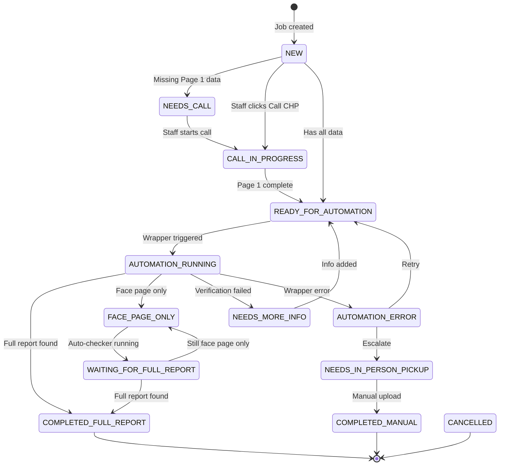

# Business Logic

**Document:** InstaTCR Business Logic & User Flows
**Version:** 2.1 (Updated for V1.2.0)
**Last Updated:** 2025-12-12
**Audience:** All engineers, product designers, QA

---

## Table of Contents
- [3. Complete User Flows](#3-complete-user-flows)
- [4. Status System Architecture](#4-status-system-architecture)
- [5. Data Model Reference](#5-data-model-reference)

---

## 3. Complete User Flows

### Flow 1: Complete Information Path (Happy Path)

**When:** Staff has all crash details including driver name from the start.

**Actors:** Law Firm User, InstaTCR Staff, CHP Wrapper

**Steps:**

1. **Law Firm creates request**
   - Submits client name: "Dora Cruz-Arteaga"
   - Submits report number: "9465-2025-02802"
   - Job created with status: `NEW` → Law firm sees: `SUBMITTED`

2. **Staff enters Page 1 data**
   - Opens job in Staff Job Detail
   - Clicks "Call CHP" button (status → `CALL_IN_PROGRESS`)
   - Enters crash date: "12/01/2025"
   - Enters crash time: "1430" (2:30 PM)
   - NCIC auto-derived: "9465"
   - Enters officer ID: "012345"
   - Saves Page 1

3. **Staff enters Page 2 data**
   - First name auto-populated: "Dora"
   - Last name auto-populated: "Cruz-Arteaga"
   - Optionally adds plate, license, VIN
   - Saves Page 2

4. **Staff triggers CHP Wrapper**
   - Prerequisites met (Page 1 complete + Page 2 has name)
   - Clicks "Run CHP Wrapper"
   - Status → `AUTOMATION_RUNNING` → Law firm sees: `CONTACTING_CHP`
   - Wrapper runs for 8-13 seconds

5. **Result: Full Report Downloaded**
   - Wrapper returns: `FULL`
   - Status → `COMPLETED_FULL_REPORT` → Law firm sees: `REPORT_READY`
   - Staff downloads PDF, reviews, marks complete
   - Law firm can download full report

**Timeline:** ~5-10 minutes total

---

### Flow 2: Incomplete Information Path

**When:** Staff only has Page 1 details, no driver name yet.

**Actors:** Law Firm User, InstaTCR Staff, CHP Wrapper

**Steps:**

1. **Law Firm creates request** (same as Flow 1)

2. **Staff enters Page 1 data only**
   - Has crash date, time, NCIC, officer ID
   - Does NOT have driver name (law firm didn't provide)
   - Saves Page 1

3. **Staff attempts to run wrapper**
   - Button disabled: "Complete Page 1 and add at least one Page 2 field"
   - OR if forced: Wrapper returns `ERROR` - "Verification required"

4. **Job paused**
   - Status → `NEEDS_MORE_INFO` → Law firm sees: `NEEDS_INFO`
   - Message: "We need a bit more information to continue"
   - Auto-checker: LOCKED

**Resolution:** Staff must obtain driver name (from law firm or CHP call) before retrying.

---

### Flow 3: Face Page Upload & Driver Name Entry

**When:** Staff received physical face page from CHP (in-person pickup) or wrapper returned face page only.

**Actors:** InstaTCR Staff

**Steps:**

1. **Starting state:** Job in `FACE_PAGE_ONLY` or `NEEDS_MORE_INFO`

2. **Staff opens Manual Completion card**
   - Selects file type: "Face Page"
   - Clicks "Upload File"
   - Selects PDF from computer

3. **Staff enters guaranteed name**
   - Required field appears: "Guaranteed Name"
   - Enters name exactly as shown on face page: "DORA CRUZ-ARTEAGA"
   - This is the verified name from the official document

4. **Staff saves**
   - Face page stored in Convex Storage
   - Guaranteed name stored on job
   - Status → `FACE_PAGE_ONLY` (if wasn't already)
   - Auto-checker: UNLOCKED

5. **Result**
   - Law firm can download face page
   - Staff can use auto-checker to monitor for full report
   - Message: "We've received a preliminary copy (face page) from CHP"

---

### Flow 4: Auto-Checker ("Is This Ready Yet?")

**When:** Job has face page AND driver name (auto-checker unlocked).

**Actors:** InstaTCR Staff, CHP Wrapper

**Unlock Conditions:**
- Has face page document (uploaded or from wrapper)
- Has driver name (guaranteed name from face page OR firstName/lastName from Page 2)

**Steps:**

1. **Staff opens Auto-Checker card**
   - Shows "Unlocked" status with green checkmarks
   - Conditions displayed:
     - ✅ Has face page: Yes
     - ✅ Has driver name: Yes

2. **Staff clicks "Check if Full Report Ready"**
   - Button shows loading state
   - System calls CHP wrapper with stored info
   - Checks if full report now available

3. **Result A: Still Only Face Page**
   - Wrapper returns: `FACE_PAGE`
   - Message: "The full report isn't ready yet. Check back later."
   - Status remains: `FACE_PAGE_ONLY`
   - Auto-checker stays unlocked (can check again)

4. **Result B: Full Report Now Available**
   - Wrapper returns: `FULL`
   - Message: "Great news! We just grabbed the full report."
   - Full report downloaded and stored
   - Status → `COMPLETED_FULL_REPORT` → Law firm sees: `REPORT_READY`

**Note:** Auto-checker can still be run even after full report obtained (for re-downloading if needed).

---

### Flow 5: Manual Escalation

**When:** Automation fails repeatedly or cannot proceed.

**Actors:** InstaTCR Staff, Specialist

**Escalation Triggers:**
- Multiple `ERROR` results from wrapper
- `NO_RESULT` with no additional party info available
- Special circumstances (corrupt files, portal issues)

**Steps:**

1. **Staff opens Escalation card**
   - Clicks "Escalate to Manual Pickup"

2. **Staff enters escalation notes**
   - Explains why escalating: "Wrapper failed 3 times, CHP portal may be down"
   - Confirms escalation

3. **Job escalated**
   - Status → `NEEDS_IN_PERSON_PICKUP` → Law firm sees: `IN_PROGRESS`
   - Job visible to all staff globally (V1: no individual assignment)

4. **Specialist retrieves report**
   - Goes to CHP office in person
   - Obtains physical copy
   - Returns to InstaTCR

5. **Specialist uploads and completes**
   - Opens Manual Completion card
   - Selects "Full Report"
   - Uploads PDF
   - Adds completion notes
   - Clicks "Mark as Completed"
   - Status → `COMPLETED_MANUAL` → Law firm sees: `REPORT_READY`

---

### Flow 6: VAPI AI Caller (Future V3)

**When:** Staff needs crash time and officer ID but doesn't want to call manually.

**Actors:** InstaTCR Staff, VAPI AI Caller, CHP Office

**Steps:**

1. **Staff opens Page 1 Data card**
   - Sees two buttons: "Call CHP" (manual) and "AI Caller" (automatic)
   - Clicks "AI Caller" button

2. **VAPI initiates call**
   - Button shows: "🔄 AI calling Los Angeles CHP..."
   - Status display: "Attempt 1 of 5 • 00:45 elapsed"

3. **AI speaks to CHP dispatcher**
   - Introduces as calling from law firm
   - Provides report number (digit by digit)
   - Requests crash time and officer ID
   - Confirms information received

4. **Result A: Success**
   - AI obtained crash time and officer ID
   - Fields auto-filled in Page 1 form
   - Button shows: "✅ Call Complete - Data Filled"
   - Staff reviews and saves

5. **Result B: Office Failed**
   - AI couldn't get info (office closed, no match, etc.)
   - System tries next office (office hopping)
   - "Attempt 2 of 5 • Trying East LA CHP..."

6. **Result C: All Offices Failed**
   - After 5 attempts, all failed
   - Button shows: "❌ Call Failed - Try Manual"
   - Staff must call manually

**Office Hopping Logic:**
- Retryable outcomes: `OFFICE_CLOSED_OR_VOICEMAIL`, `CALL_DROPPED_OR_TOO_NOISY`, `TRANSFERRED_LOOP_OR_TIMEOUT`
- Non-retryable: `SUCCESS`, `REPORT_NOT_FOUND`, `NO_INFORMATION_GIVEN`

---

### Flow 7: Rescue/Retry Flow (V1.2.0+)

**When:** Wrapper returns `PAGE1_NOT_FOUND` or `PAGE2_VERIFICATION_FAILED`.

**Actors:** Law Firm User, CHP Wrapper

**Purpose:** Allow law firms to correct information or provide additional identifiers to retry the wrapper when initial attempts fail.

**Flow Diagram:**

```
Flow Wizard Complete
        ↓
  [Wrapper Runs]
        ↓
   ┌────┴────┐
   ↓         ↓
SUCCESS   FAILURE
   ↓         ↓
Timeline   ┌─────┴─────┬─────────────┐
+ Download ↓           ↓             ↓
        PAGE1_NOT_FOUND  PAGE2_FAIL  PORTAL_ERROR
             ↓              ↓              ↓
        InlineFieldsCard  RescueForm   Auto-retry
             ↓              ↓
        [Retry Wrapper]  [Retry Wrapper]
```

---

#### Flow 7A: Page 1 Not Found (Correction Path)

**When:** Wrapper returns `PAGE1_NOT_FOUND` - report not found with given date/time/officer.

**Steps:**

1. **Wrapper returns PAGE1_NOT_FOUND**
   - Timeline message: "We couldn't find a report matching those details."
   - InlineFieldsCard shown for corrections

2. **Law firm corrects Page 1 data**
   - Can update crash date, crash time, officer ID
   - "Save & Check for Report" button

3. **Wrapper re-runs automatically**
   - Checks with corrected information
   - Status: `AUTOMATION_RUNNING`

4. **Result:** Success or another failure type

---

#### Flow 7B: Page 2 Verification Failed (Rescue Path)

**When:** Wrapper returns `PAGE2_VERIFICATION_FAILED` - Page 1 succeeded but verification failed.

**Key Feature:** reportTypeHint is preserved from Page 1 success, so law firm knows whether to expect full report or face page.

**Steps:**

1. **Wrapper returns PAGE2_VERIFICATION_FAILED**
   - Timeline message: "We found your report, but need additional identifiers to verify and retrieve it."
   - Shows reportTypeHint: "The full report is available" or "A preliminary copy (face page) is available"
   - DriverInfoRescueForm shown

2. **Law firm fills rescue form**
   - Can provide: License Plate, Driver's License, VIN
   - Can add additional names (repeatable)
   - All fields optional, but at least one improves chances

3. **Law firm submits rescue form**
   - Button: "Save & Check Again"
   - Timeline event: `rescue_info_saved`
   - Wrapper re-runs automatically with new data

4. **Wrapper re-runs**
   - Uses original Page 1 data + new verification data
   - Timeline event: `rescue_wrapper_triggered`

5. **Result:** Success (FULL or FACE_PAGE) or another failure

---

#### Flow 7C: Portal Error (Auto-Retry Path)

**When:** Wrapper returns `PORTAL_ERROR` - technical failure.

**Behavior:**
- Timeline message: "We're experiencing technical difficulties. We'll automatically retry."
- No user action required
- System may auto-retry or staff can manually trigger

---

#### Rescue Form Visibility Conditions

**DriverInfoRescueForm shown when ALL true:**
1. At least one wrapper run with `result === 'PAGE2_VERIFICATION_FAILED'`
2. `rescueInfoProvided` is not yet true
3. Job status is not completed/cancelled

**InlineFieldsCard for corrections shown when ALL true:**
1. At least one wrapper run with `result === 'PAGE1_NOT_FOUND'`
2. Job status is not completed/cancelled
3. Flow wizard is complete (`flowStep === 'done'`)

---

## 4. Status System Architecture

### Status Design Philosophy

The status system has two layers:
1. **Internal Status:** What staff sees - technical, detailed, reflects actual system state
2. **Public Status:** What law firms see - friendly, simplified, hides technical details

This separation is critical: law firms should never know about automation, manual pickups, or technical errors.

### Complete Status Mapping Table

| Internal Status | Public Status | Badge Color | Description (Staff) | Message (Law Firm) |
|-----------------|---------------|-------------|---------------------|-------------------|
| `NEW` | `IN_PROGRESS` | Blue | Job just created, entering active state | "We're working on your request." |
| `NEEDS_CALL` | `IN_PROGRESS` | Blue | Requires phone call to CHP for crash details | "We're working on your request" |
| `CALL_IN_PROGRESS` | `CONTACTING_CHP` | Blue (pulse) | Currently calling CHP | "We're contacting CHP about your report" |
| `READY_FOR_AUTOMATION` | `IN_PROGRESS` | Blue | Ready to trigger CHP wrapper | "We're working on your request" |
| `AUTOMATION_RUNNING` | `CONTACTING_CHP` | Blue (animated) | CHP wrapper currently executing | "We're contacting CHP about your report" |
| `FACE_PAGE_ONLY` | `FACE_PAGE_READY` | Yellow | Face page downloaded, full report not ready | "We've received a preliminary copy (face page) from CHP" |
| `WAITING_FOR_FULL_REPORT` | `WAITING_FOR_REPORT` | Yellow | Checking if full report available | "We're waiting for the full report from CHP" |
| `COMPLETED_FULL_REPORT` | `REPORT_READY` | Green | Full report successfully downloaded | "Your report is ready to download" |
| `COMPLETED_MANUAL` | `REPORT_READY` | Green | Manually completed by specialist | "Your report is ready to download" |
| `NEEDS_MORE_INFO` | `NEEDS_INFO` | Amber | Missing verification info (driver name) | "We need a bit more information to continue" |
| `NEEDS_IN_PERSON_PICKUP` | `IN_PROGRESS` | Blue | Requires manual retrieval from CHP office | "We're working on your request" |
| `AUTOMATION_ERROR` | `IN_PROGRESS` | Blue | Wrapper encountered error | "We're working on your request" |
| `CANCELLED` | `CANCELLED` | Red | Request cancelled | "This request has been closed" |

### Status Badge Colors

```typescript
const statusColors = {
  // Success states
  REPORT_READY: 'green',
  COMPLETED_FULL_REPORT: 'green',
  COMPLETED_MANUAL: 'green',

  // In progress states
  CONTACTING_CHP: 'blue',
  IN_PROGRESS: 'blue',
  CALL_IN_PROGRESS: 'blue',
  AUTOMATION_RUNNING: 'blue',

  // Waiting states
  FACE_PAGE_READY: 'yellow',
  FACE_PAGE_ONLY: 'yellow',
  WAITING_FOR_REPORT: 'yellow',
  WAITING_FOR_FULL_REPORT: 'yellow',

  // Action needed
  NEEDS_INFO: 'amber',
  NEEDS_MORE_INFO: 'amber',

  // Initial/terminal
  SUBMITTED: 'gray',
  NEW: 'blue',  // V1.0.6+: NEW maps to IN_PROGRESS (active state)
  CANCELLED: 'red',
};
```

### Status Transition Rules



---

## 5. Data Model Reference

### Job Record (chpJobs)

The primary data structure for crash report requests.

```typescript
interface Job {
  // ========== V1 MVP FIELDS ==========
  // Identity
  _id: string;                      // Unique job ID (Convex ID)

  // Law Firm Info
  lawFirmId: string;                // Which law firm owns this job
  lawFirmName: string;              // Law firm display name

  // Client Info (V1 basic tracking)
  clientName: string;               // Full name: "Dora Cruz-Arteaga"

  // Report Info
  reportNumber: string;             // Format: "9XXX-YYYY-ZZZZZ"

  // Page 1 Data (Crash Details)
  crashDate?: string;               // Format: "mm/dd/yyyy"
  crashTime?: string;               // Format: "HHMM" (24-hour, e.g., "1430")
  ncic?: string;                    // 4 digits, starts with "9" (auto-derived from reportNumber)
  officerId?: string;               // 6 digits, starts with "0"
  locationDescription?: string;     // Optional location reference

  // Page 2 Data (Verification)
  firstName?: string;               // Auto-split from clientName
  lastName?: string;                // Auto-split from clientName
  plate?: string;                   // License plate number
  driverLicense?: string;           // Driver's license number
  vin?: string;                     // Vehicle identification number

  // Status & Files
  internalStatus: InternalStatus;   // Staff-facing status
  facePageToken?: string;           // Convex storage ID for face page PDF
  fullReportToken?: string;         // Convex storage ID for full report PDF

  // CHP Wrapper History (V1 basic runs)
  wrapperRuns?: WrapperRun[];       // Array of all wrapper executions

  // Timestamps
  createdAt: number;                // Unix timestamp (ms)
  updatedAt: number;                // Unix timestamp (ms)

  // ========== V1.0.5+ INTERACTIVE STATE ==========
  // Frontend state tracking for interactive flows
  clientType?: 'driver' | 'passenger' | null; // V1.0.5+: null until selected
  interactiveState?: InteractiveState;        // V1.0.5+: Flow wizard and rescue tracking
  passengerProvidedData?: PassengerProvidedData; // V1.0.5+: Data from passenger mini form

  // ========== V2 BACKEND FIELDS ==========
  // Additional tracking for enhanced workflow
  caseReference?: string;           // Law firm's internal case number
  additionalPartyInfo?: string;     // Other driver/passenger details
  createdBy?: string;               // User ID who created job
  wasAutoEscalated?: boolean;       // True if auto-escalated to manual
  guaranteedName?: string;          // Verified name from manually uploaded face page
  lastWrapperRun?: number;          // Timestamp of most recent run
  lastWrapperResult?: WrapperResultType; // Result of most recent run
  escalationNotes?: string;         // Notes about why escalated

  // ========== V3 VAPI FIELDS ==========
  // Voice AI caller integration
  officeAttemptIndex?: number;      // Current office index for hopping
  officeAttempts?: OfficeAttempt[]; // History of VAPI call attempts
}
```

### Status Enums

```typescript
type InternalStatus =
  | 'NEW'
  | 'NEEDS_CALL'
  | 'CALL_IN_PROGRESS'
  | 'READY_FOR_AUTOMATION'
  | 'AUTOMATION_RUNNING'
  | 'FACE_PAGE_ONLY'
  | 'WAITING_FOR_FULL_REPORT'
  | 'COMPLETED_FULL_REPORT'
  | 'COMPLETED_MANUAL'
  | 'NEEDS_MORE_INFO'
  | 'NEEDS_IN_PERSON_PICKUP'
  | 'AUTOMATION_ERROR'
  | 'CANCELLED';

type PublicStatus =
  | 'SUBMITTED'
  | 'IN_PROGRESS'
  | 'CONTACTING_CHP'
  | 'FACE_PAGE_READY'
  | 'WAITING_FOR_REPORT'
  | 'REPORT_READY'
  | 'NEEDS_INFO'
  | 'CANCELLED';
```

### Interactive State (V1.0.5+)

```typescript
// V1.1.0+: Flow wizard step tracking
type FlowStep = 'selection' | 'verification' | 'speedup' | 'crash_details' | 'done';

// V1.0.5+: Interactive state tracking for law firm job view
interface InteractiveState {
  // V1.0.5+ Interactive prompts
  driverPassengerAsked: boolean;    // Has driver/passenger prompt been shown?
  chpNudgeDismissed: boolean;       // Has CHP call nudge been dismissed?

  // V1.1.0+ Flow wizard tracking
  flowStep?: FlowStep;              // Current step in flow wizard
  speedUpOffered?: boolean;         // Has speed-up prompt been shown?
  speedUpAccepted?: boolean;        // Did user accept speed-up?
  passengerVerification?: PassengerVerificationData; // Passenger verification form data
  crashDetailsProvided?: boolean;   // Has crash details form been submitted?
  flowCompletedAt?: number;         // Timestamp when flow completed

  // V1.2.0+ Rescue form tracking
  rescueInfoProvided?: boolean;     // Has rescue form been submitted?
  rescueInfoTimestamp?: number;     // When rescue info was provided
  rescueFormData?: RescueFormData;  // Rescue form data
}

// V1.0.5+: Data provided by passenger from mini form
interface PassengerProvidedData {
  plate?: string;                   // License plate from passenger
  driverLicense?: string;           // Driver license from passenger
  vin?: string;                     // VIN from passenger
  providedAt: number;               // Timestamp when provided
}

// V1.1.0+: Passenger verification form data
interface PassengerVerificationData {
  plate?: string;
  driverLicense?: string;
  vin?: string;
  additionalNames?: Array<{ firstName: string; lastName: string }>;
}

// V1.2.0+: Rescue form data for Page 2 verification failures
interface RescueFormData {
  plate?: string;
  driverLicense?: string;
  vin?: string;
  additionalNames?: Array<{ firstName: string; lastName: string }>;
}
```

### Wrapper Run Record

```typescript
// ========== V1 MVP IMPLEMENTATION (V1.2.0+) ==========
// Wrapper execution tracking with conditional rescue support
interface WrapperRun {
  runId: string;                    // Unique execution ID
  timestamp: number;                // When wrapper was executed
  result: WrapperResult;            // See WrapperResult type below
  duration: number;                 // Execution time in ms
  errorMessage?: string;            // Error details if result === PORTAL_ERROR
  page1Passed?: boolean;            // V1.2.0+: True if Page 1 search succeeded
  reportTypeHint?: ReportTypeHint;  // V1.2.0+: Known report type even when verification fails
}

// V1.2.0+: 5 distinct result types for failure differentiation
type WrapperResult =
  | 'FULL'                      // Success - full report downloaded
  | 'FACE_PAGE'                 // Success - face page only (full report not yet available)
  | 'PAGE1_NOT_FOUND'           // Page 1 failed - report not found with given date/time/officer
  | 'PAGE2_VERIFICATION_FAILED' // Page 1 passed, Page 2 verification failed - needs rescue form
  | 'PORTAL_ERROR';             // Technical error (timeout, portal down, etc.) - auto-retry

// V1.2.0+: Report type hint known after Page 1 succeeds
type ReportTypeHint = 'FULL' | 'FACE_PAGE' | 'UNKNOWN';

// ========== V2+ EXTENDED IMPLEMENTATION ==========
// Full tracking with debugging and reporting capabilities
interface WrapperRunExtended extends WrapperRun {
  message: string;                  // Human-readable result message
  downloadToken?: string;           // Convex storage ID for downloaded PDF
  journeyLog: JourneyStep[];        // Step-by-step automation log
  inputSent: {                      // What data was sent to wrapper
    reportNumber: string;
    crashDate: string;
    crashTime: string;
    ncic: string;
    officerId: string;
    firstName?: string;
    lastName?: string;
    plate?: string;
    driverLicense?: string;
    vin?: string;
  };
}

interface JourneyStep {
  timestamp: string;                // ISO timestamp
  step: string;                     // Step name
  status: 'success' | 'error';
  details?: string;                 // Additional info
}
```

### Office Attempt Record (V3 - VAPI)

```typescript
interface OfficeAttempt {
  officeCalled: string;             // Office phone or name
  outcome: VAPIOutcome;             // Result of the call
  confidence: 'HIGH' | 'MEDIUM' | 'LOW';
  crashTime24h?: string;            // Extracted crash time
  officerId?: string;               // Extracted officer ID
  rawTimeSpoken?: string;           // Exact words for time
  rawOfficerIdSpoken?: string;      // Exact words for officer ID
  callNotes?: string;               // Summary of what happened
  calledAt: number;                 // Timestamp
}

type VAPIOutcome =
  | 'SUCCESS'
  | 'REPORT_NOT_FOUND'
  | 'NO_INFORMATION_GIVEN'
  | 'OFFICE_CLOSED_OR_VOICEMAIL'
  | 'CALL_DROPPED_OR_TOO_NOISY'
  | 'TRANSFERRED_LOOP_OR_TIMEOUT';
```

### Event Record (jobEvents)

Timeline events for each job.

```typescript
interface JobEvent {
  _id: string;                      // Unique event ID
  jobId: string;                    // Reference to job
  eventType: EventType;             // Type of event
  message: string;                  // Human-readable description
  isUserFacing: boolean;            // True = visible to law firm
  userId?: string;                  // Who triggered this event
  timestamp: number;                // When event occurred
  metadata?: Record<string, any>;   // Additional event data
}

type EventType =
  // V1 MVP Event Types (Base)
  | 'job_created'
  | 'status_change'
  | 'page1_updated'
  | 'page2_updated'
  | 'wrapper_triggered'
  | 'wrapper_completed'
  | 'file_uploaded'
  | 'check_requested'              // Auto-checker run
  | 'escalated'
  | 'completed'
  | 'message'

  // V1.0.5+ Interactive Prompt Events
  | 'driver_passenger_prompt'      // Prompt shown asking driver/passenger
  | 'driver_selected'              // User selected "Driver"
  | 'passenger_selected'           // User selected "Passenger"
  | 'passenger_data_provided'      // Passenger submitted mini form
  | 'chp_nudge_shown'              // CHP call nudge displayed

  // V1.0.6+ Auto-Wrapper Events
  | 'page1_details_request'        // Crash details prompt shown
  | 'auto_wrapper_triggered'       // Law firm triggered wrapper
  | 'auto_wrapper_success'         // Auto-wrapper succeeded
  | 'auto_wrapper_failed'          // Auto-wrapper failed

  // V1.1.0+ Flow Wizard Events
  | 'flow_speedup_prompt'          // Speed-up prompt shown
  | 'flow_speedup_yes'             // User accepted speed-up
  | 'flow_speedup_no'              // User declined speed-up
  | 'flow_crash_details_saved'     // Crash details saved in flow
  | 'flow_verification_saved'      // Passenger verification saved in flow
  | 'flow_completed'               // Flow wizard completed

  // V1.2.0+ Rescue Flow Events
  | 'page1_not_found'              // Page 1 search failed
  | 'page2_verification_needed'    // Page 2 verification failed, rescue needed
  | 'rescue_info_saved'            // Rescue form submitted
  | 'rescue_wrapper_triggered'     // Wrapper re-triggered after rescue

  // V3 VAPI Event Types (Future)
  | 'vapi_call_started'
  | 'vapi_call_completed'
  | 'vapi_call_failed';
```

### User-Facing Events

Events with `isUserFacing: true` appear in the law firm chat timeline:

| Event Type | Message Example |
|------------|-----------------|
| `job_created` | "Request submitted" |
| `status_change` to CONTACTING_CHP | "We're contacting CHP about your report" |
| `wrapper_completed` with FACE_PAGE | "We've received a preliminary copy (face page) from CHP" |
| `wrapper_completed` with FULL | "Your report is ready to download" |
| `status_change` to NEEDS_INFO | "We need a bit more information to continue" |
| `completed` | "Your report is ready to download" |

---

**Related Documents:**
- [Product Foundation](01-product-foundation.md) - Vision, roadmap, architecture
- [Screen Specifications](03-screen-specifications.md) - All 6 screen UI/UX specs
- [CHP Wrapper](04-chp-wrapper.md) - Automation engine deep dive
- [Implementation Guide](06-implementation-guide.md) - Validation rules and standards
- [CHANGELOG.md](../../CHANGELOG.md) - What's actually shipped

*Part of the InstaTCR documentation suite. See [INSTATCR-MASTER-PRD.md](../../INSTATCR-MASTER-PRD.md) for navigation.*
